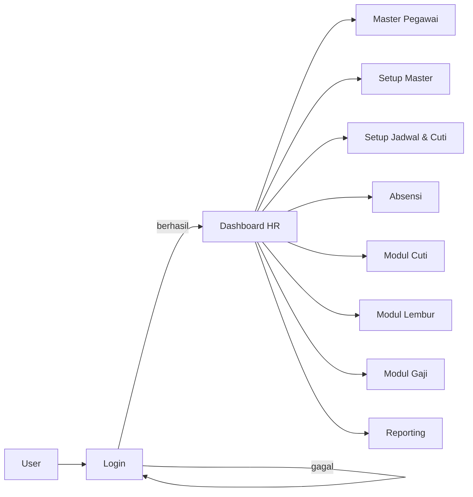
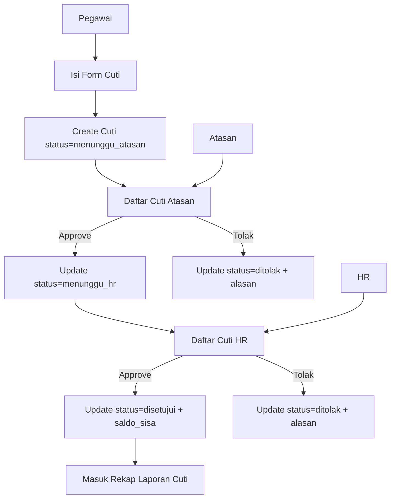
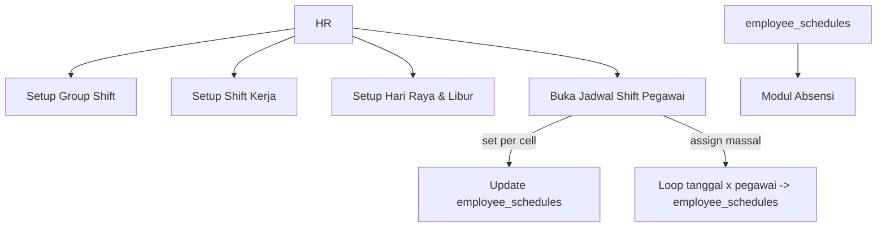
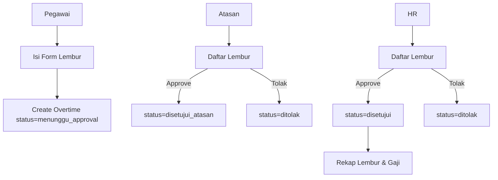
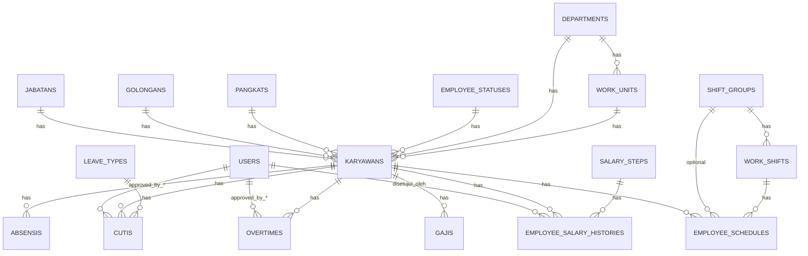

## Blueprint Sistem Smart HR (PILAR HR)

Dokumen ini merangkum blueprint aplikasi **Smart HR / PILAR HR** yang Anda bangun untuk capstone, meliputi:

- Gambaran umum modul dan alur bisnis.
- Flowchart proses inti.
- ERD (Entity Relationship Diagram) ringkas.
- Ringkasan modul yang sudah diimplementasikan di project Laravel ini.

---

## 1. Gambaran Umum Sistem

Sistem Smart HR mendigitalisasi proses HR utama di perusahaan:

- **Manajemen Data Karyawan** (Master Pegawai, struktur organisasi).
- **Pengelolaan Jadwal & Absensi** (shift, hari libur, jadwal per pegawai).
- **Manajemen Cuti** (master jenis cuti, transaksi, approval berlapis).
- **Manajemen Lembur** (order lembur, persetujuan atasan dan HR).
- **Penggajian Berkala** (skala gaji dan riwayat kenaikan gaji).
- **Pelaporan & Dashboard** untuk pengambilan keputusan HR.

Sistem dibangun dengan arsitektur **MVC Laravel 11**, database MySQL, dan antarmuka HTML/Blade.

---

## 2. Flow Proses Utama

### 2.1. Flow Umum Login & Akses Modul

### 2.2. Flow Pengajuan & Approval Cuti

### 2.3. Flow Pengelolaan Jadwal Shift Pegawai

### 2.4. Flow Order & Approval Lembur

---

## 3. ERD (Entity Relationship Diagram) Ringkas

### 3.1. Relasi Utama

### 3.2. Atribut Utama per Tabel (Ringkasan)

- **KARYAWANS**
  - `id, nik, name, nama_lengkap, email, jenis_kelamin, telephone, status`
  - FK: `jabatan_id, golongan_id, pangkat_id, employee_status_id, department_id, work_unit_id`
  - Data personal: `tempat_lahir, tanggal_lahir, agama, status_perkawinan, alamat, provinsi, kota, kecamatan, kelurahan, kode_pos`
  - Payroll: `bank, no_rekening, bpjs_kesehatan, bpjs_ketenagakerjaan`
  - Riwayat: `tanggal_masuk, tanggal_keluar, alasan_keluar`

- **JABATANS**
  - `id, nama_jabatan, jam_mulai_kerja, jam_selesai_kerja, note_pekerjaan, gaji_pokok, tunjangan, potongan`

- **GOLONGANS / PANGKATS / EMPLOYEE_STATUSES / DEPARTMENTS / WORK_UNITS**
  - Kode + nama + flag aktif.
  - `WORK_UNITS` memiliki `department_id`.

- **ABSENSIS**
  - `id, karyawan_id, status_absen(hadir/alpha/cuti), keterangan, tanggal_absensi, time`.

- **HOLIDAYS**
  - `id, tanggal, kode_libur, keterangan, is_tetap, is_hari_raya`.

- **SHIFT_GROUPS**
  - `id, kode, nama, tipe_absen, istirahat_menit`.

- **WORK_SHIFTS**
  - `id, shift_group_id, kode, nama, jam_masuk, jam_pulang, jam_mulai_telat, jam_masuk_cepat, toleransi_telat_menit, is_aktif`.

- **EMPLOYEE_SCHEDULES**
  - `id, karyawan_id, shift_group_id, work_shift_id, tanggal, is_libur`.

- **LEAVE_TYPES (Master Jenis Cuti)**
  - `id, kode, nama, grup, pakai_periode, satuan_periode, max_expired, satuan_expired, min_masa_kerja, satuan_masa_kerja, max_backdate, rekap`.

- **CUTIS (Transaksi Cuti)**
  - `id, karyawan_id, leave_type_id, tanggal_mulai, tanggal_berakhir, keterangan, jenis_cuti`
  - Status & saldo: `status, saldo_awal, hak_diambil, saldo_sisa`
  - Approval:
    - `approved_by_supervisor_id, approved_at_supervisor`
    - `approved_by_hr_id, approved_at_hr`
    - `rejected_by_id, rejected_reason`.

- **OVERTIMES (Lembur)**
  - `id, karyawan_id, tanggal, jam_mulai, jam_selesai, jumlah_jam, jenis_hari, keterangan_pekerjaan, status`
  - Approval:
    - `approved_by_supervisor_id, approved_at_supervisor`
    - `approved_by_hr_id, approved_at_hr`
    - `rejected_by_id, rejected_reason`.

- **SALARY_STEPS (Skala Gaji Berkala)**
  - `id, kode, deskripsi, gaji_pokok, tunjangan_tetap, masa_kerja_min, masa_kerja_maks`.

- **EMPLOYEE_SALARY_HISTORIES (Riwayat Gaji Berkala Pegawai)**
  - `id, karyawan_id, salary_step_id, gaji_pokok, tunjangan_tetap, tunjangan_lain, tanggal_berlaku, alasan, disetujui_oleh`.

---

## 4. Blueprint Modul yang Diimplementasikan

### 4.1. Modul Master

- **Master Pegawai**
  - CRUD data pegawai dengan tab:
    - Data Umum.
    - Data Kepegawaian (jabatan, golongan, pangkat, status pegawai RS, departemen, unit kerja).
    - Payroll & TAX (bank, rekening, BPJS, KTP, NPWP).
  - Relasi ke Jabatan, Golongan, Pangkat, Status Pegawai RS, Departemen, Unit Kerja.

- **Setup Master Lain**
  - Jabatan, Golongan, Pangkat, Status Pegawai RS.
  - Departemen dan Unit Kerja.

### 4.2. Modul Jadwal & Absensi

- **Setup Hari Raya & Libur**
  - Master tanggal libur dan hari raya untuk kalender absensi dan cuti.

- **Setup Group Shift & Shift Kerja**
  - Group Shift: tipe absen, istirahat.
  - Shift Kerja: jam masuk/pulang, toleransi telat, status aktif.

- **Jadwal Shift Pegawai**
  - Grid jadwal per bulan (pegawai × tanggal).
  - Pengaturan jadwal per cell dan assignment massal dalam rentang tanggal.

- **Absensi**
  - Pencatatan kehadiran: hadir / cuti / alpha.

### 4.3. Modul Cuti

- **Master Jenis Cuti (`LEAVE_TYPES`)**
  - Jenis cuti tahunan, sakit, melahirkan, dll. dengan pengaturan periode, masa kerja minimal, masa berlaku, max backdate, dan flag rekap.

- **Transaksi Cuti (`CUTIS`)**
  - Form pengajuan cuti oleh pegawai.
  - Perhitungan hak/diambil/sisa (model sederhana 12 hari/tahun).
  - Flow approval:
    - Status `menunggu_atasan` → `menunggu_hr` → `disetujui` / `ditolak`.
    - Tombol Approve/Tolak di daftar cuti untuk atasan dan HR.

### 4.4. Modul Lembur

- **Order Lembur (`OVERTIMES`)**
  - Form order lembur: pegawai, tanggal, jam mulai/selesai, jenis hari, keterangan pekerjaan.
  - Hitung otomatis jumlah jam lembur.

- **Approval Lembur**
  - Atasan menyetujui (status `disetujui_atasan`).
  - HR menyetujui akhir (status `disetujui`) atau menolak.

### 4.5. Modul Gaji & Gaji Berkala

- **Gaji Bulanan (modul awal `GajiController`)**
  - Menyimpan total gaji (total, potongan, tunjangan) per pegawai.

- **Skala Gaji Berkala (`SALARY_STEPS`)**
  - Master skala gaji: kode, gaji pokok, tunjangan tetap, batas masa kerja.

- **Riwayat Gaji Berkala Pegawai (`EMPLOYEE_SALARY_HISTORIES`)**
  - Riwayat perubahan gaji per pegawai, terhubung ke skala gaji dan user yang menyetujui.

### 4.6. Reporting & Dashboard (Blueprint)

- **Laporan Absensi**
  - Rekap hadir/cuti/alpha per pegawai dan periode.

- **Laporan Cuti**
  - Rekap hak, diambil, dan sisa cuti per pegawai.

- **Laporan Karyawan**
  - Data karyawan aktif per departemen, status pegawai RS, dan masa kerja.

- **Laporan Lembur**
  - Rekap jumlah jam lembur per pegawai dan periode.

- **Dashboard HR**
  - Kartu ringkasan:
    - Jumlah karyawan aktif.
    - Jumlah cuti aktif hari ini.
    - Jumlah jam lembur bulan ini.
    - Pegawai baru bulan ini.
  - Grafik:
    - Tren absensi bulanan.
    - Distribusi karyawan per departemen/status.

---

Dokumen `Blueprint.md` ini bisa digunakan sebagai bahan:

- Bab perancangan sistem (arsitektur, ERD, dan flowchart) di laporan capstone.
- Referensi untuk pengembangan lanjutan (menambah role, modul kinerja, dokumen karyawan, dan fitur reporting lanjutan).

