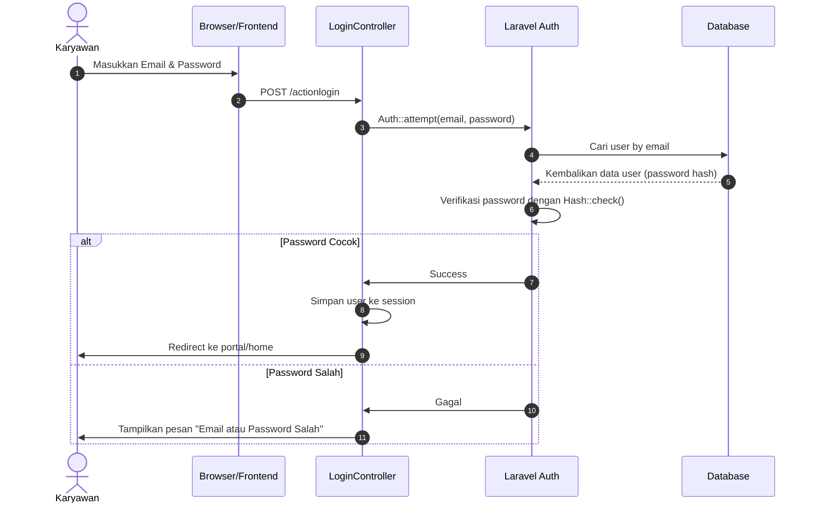
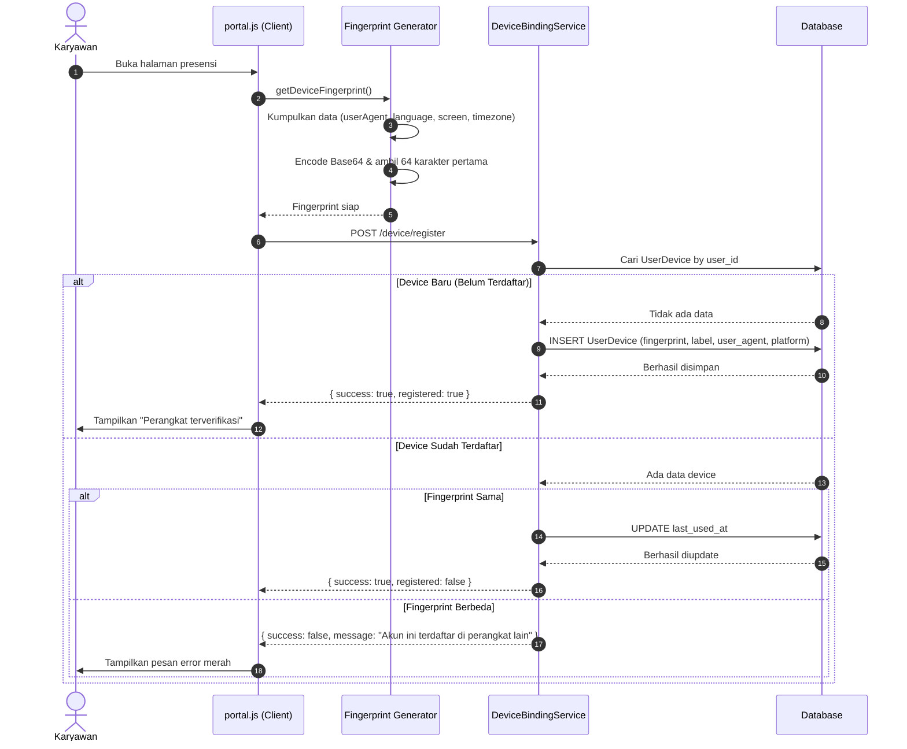
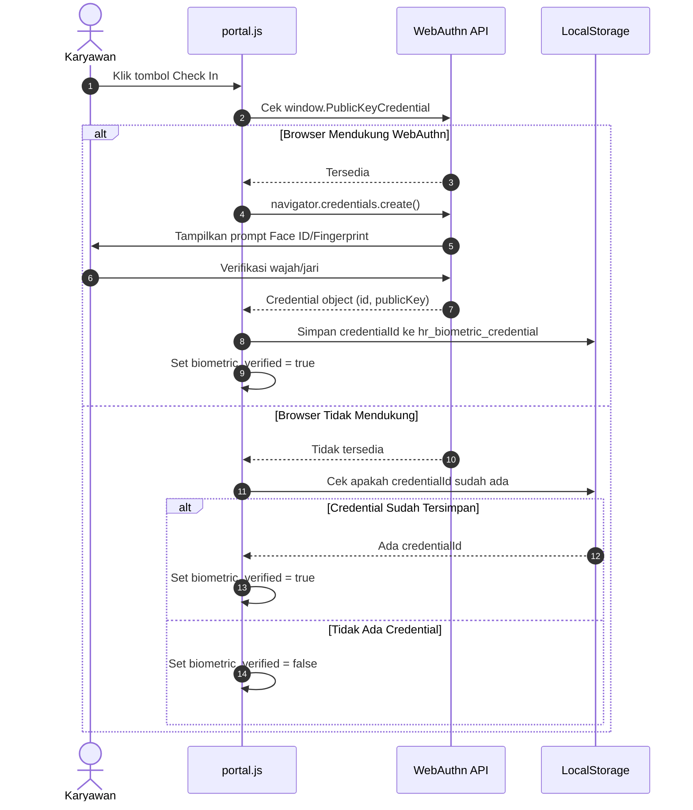
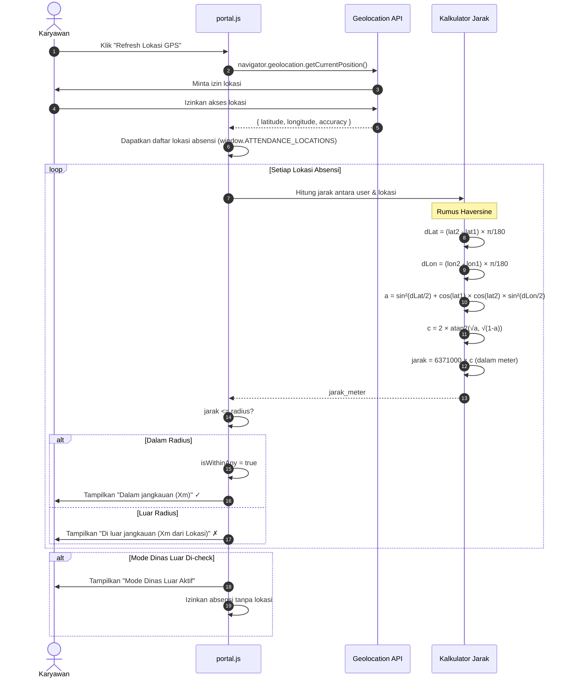
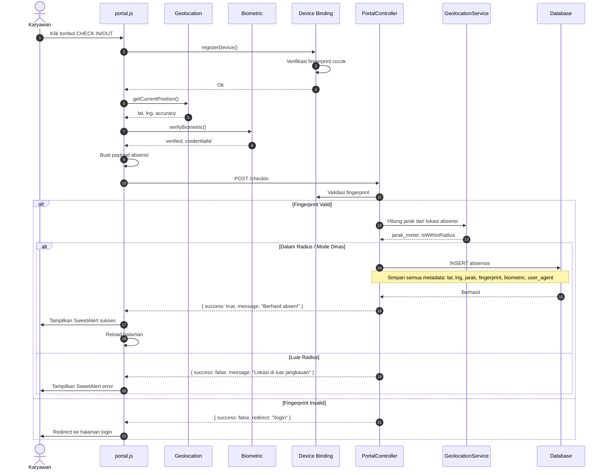
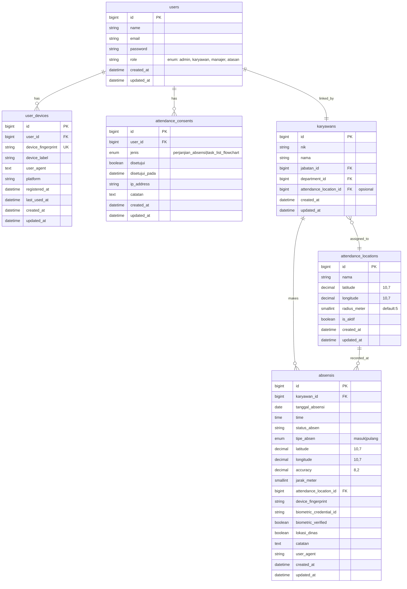

# 📘 Alur Keamanan & Presensi SmartHR (Versi Lengkap tapi Mudah Dipahami)

---

## 1️⃣ Alur Login & Autentikasi

### Diagram:


### Penjelasan Detail:
1. **Karyawan memasukkan email dan password** di halaman login
2. **Browser mengirim data ke server** via `POST /actionlogin`
3. **LoginController memanggil `Auth::attempt()`** untuk otentikasi
4. **Sistem mencari user di database** berdasarkan email
5. **Verifikasi password**: Password yang dimasukkan di-hash dan dibandingkan dengan hash di database
6. **Jika cocok**: Simpan session dan redirect ke portal karyawan
7. **Jika tidak cocok**: Kembali ke halaman login dengan pesan error

---

## 2️⃣ Alur Device Binding & Fingerprint

### Diagram:


### Detail Fingerprint:
Fingerprint di-generate dari kombinasi:
- `navigator.userAgent`: Jenis browser dan sistem operasi
- `navigator.language`: Bahasa yang digunakan browser
- `screen.width` & `screen.height`: Resolusi layar
- `screen.colorDepth`: Kedalaman warna layar
- `Intl.DateTimeFormat().resolvedOptions().timeZone`: Zona waktu

Data ini di-encode dengan Base64 dan dipotong jadi 64 karakter agar mudah disimpan.

---

## 3️⃣ Alur Verifikasi Biometrik (Face ID / Fingerprint)

### Diagram:


### Detail WebAuthn:
- **Protokol**: Web Authentication API (standar W3C)
- **Autentikator**: Platform (Touch ID, Face ID, Windows Hello)
- **User Verification**: Diwajibkan (`userVerification: 'required'`)
- **Algoritme Kriptografi**: ES256 (Elliptic Curve Digital Signature Algorithm)

---

## 4️⃣ Alur Lokasi & Geofencing

### Diagram:


### Rumus Haversine (Untuk Ngitung Jarak):
Fungsinya untuk menghitung jarak antara 2 titik di permukaan bumi:

```
R = 6371000 meter (radius bumi)
dLat = (lat2 - lat1) × π / 180
dLon = (lon2 - lon1) × π / 180
a = sin²(dLat/2) + cos(lat1) × cos(lat2) × sin²(dLon/2)
c = 2 × atan2(√a, √(1-a))
jarak = R × c
```

---

## 5️⃣ Alur Absensi Lengkap (End-to-End)

### Diagram:


---

## 📊 Skema Database Lengkap



---

## 🎯 Ringkasan Fitur Keamanan

| Fitur | Teknologi | Fungsi |
|-------|-----------|--------|
| 🔐 **Password Hashing** | Bcrypt/Argon2 (Laravel Hash) | Menyimpan password secara aman (tidak plain text) |
| 📱 **Device Binding** | Fingerprint (userAgent + screen + timezone) | Satu akun hanya bisa dipakai di satu perangkat |
| 👤 **Biometric Verification** | WebAuthn API | Verifikasi wajah/jari untuk keamanan tambahan |
| 📍 **Geofencing** | Geolocation API + Rumus Haversine | Pastikan absensi hanya di area kantor |
| 📝 **Audit Trail** | Database logging | Semua metadata absensi disimpan untuk audit |

---

## 📁 Referensi File Kode:
- [LoginController.php](file:///c:/xampp/htdocs/Aplikasi%20HR%20Karyawan/app/Http/Controllers/LoginController.php)
- [DeviceBindingService.php](file:///c:/xampp/htdocs/Aplikasi%20HR%20Karyawan/app/Services/DeviceBindingService.php)
- [GeolocationService.php](file:///c:/xampp/htdocs/Aplikasi%20HR%20Karyawan/app/Support/GeolocationService.php)
- [portal.js](file:///c:/xampp/htdocs/Aplikasi%20HR%20Karyawan/public/js/portal.js)
- [Migrasi Database](file:///c:/xampp/htdocs/Aplikasi%20HR%20Karyawan/database/migrations/2026_05_16_100000_add_portal_attendance_features.php)
