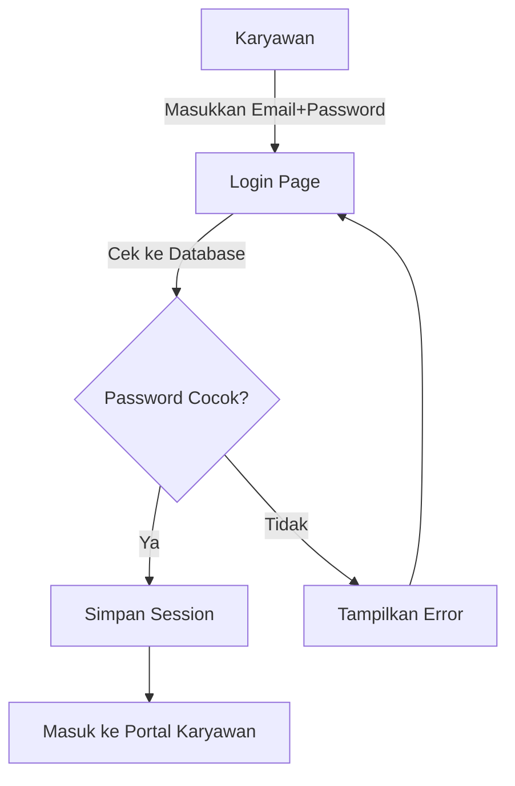
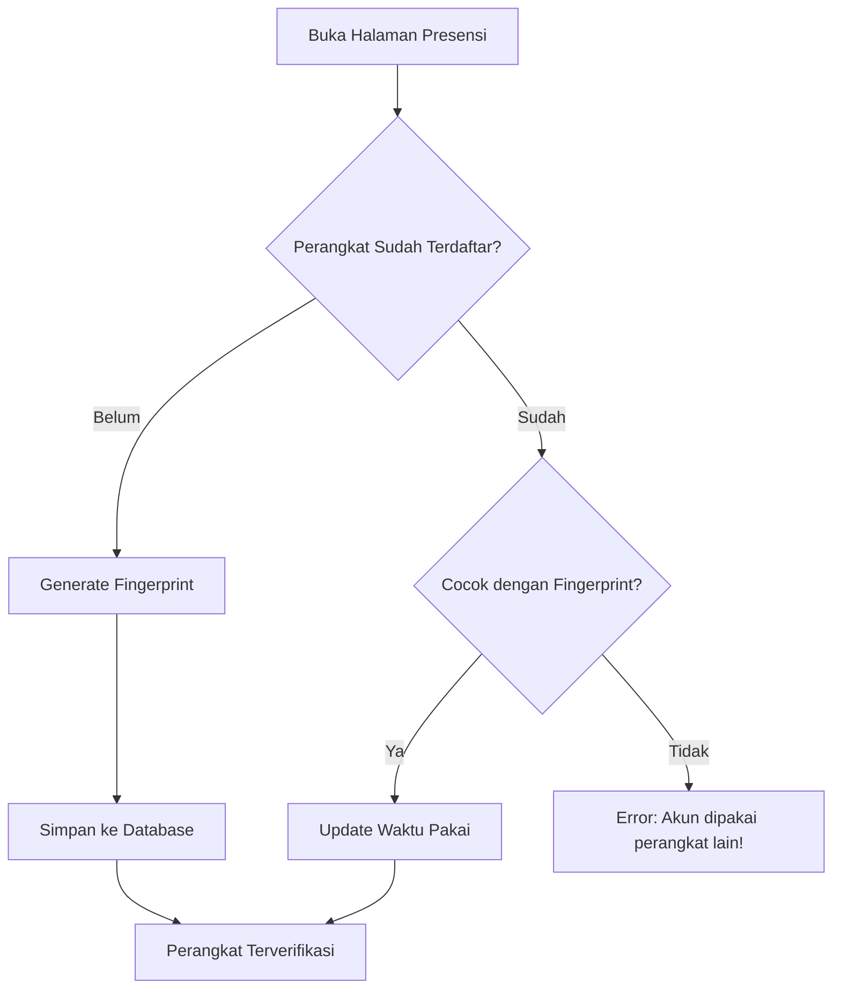
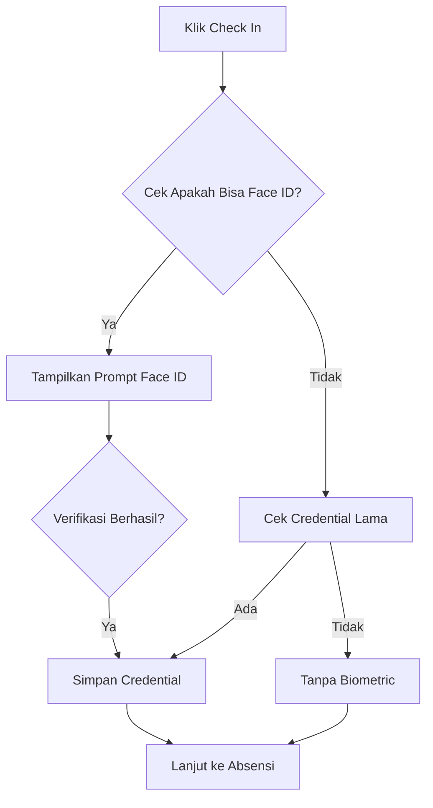
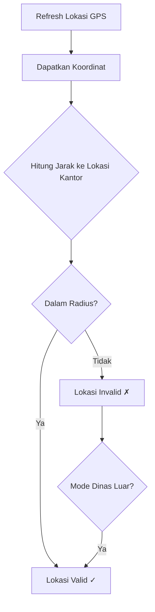
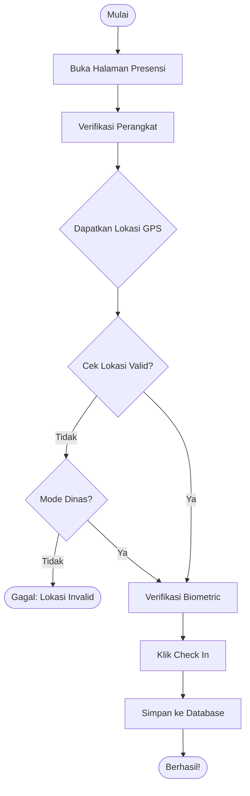
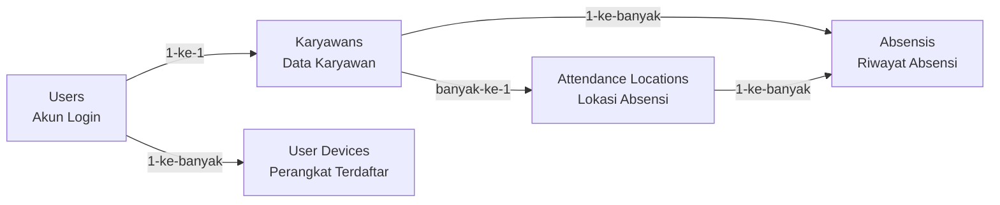

# 📘 Alur Keamanan & Presensi SmartHR (Versi Mudah Dipahami)

---

## 1️⃣ Alur Login & Autentikasi

### Diagram Sederhana:

### Penjelasan Langkah demi Langkah:
1. **Karyawan buka halaman login**
2. **Masukkan email dan password**
3. **Sistem cek ke database**:
   - Apakah email terdaftar?
   - Apakah passwordnya cocok (dengan hash)?
4. **Jika berhasil**:
   - Simpan session login
   - Arahkan ke halaman portal karyawan
5. **Jika gagal**:
   - Tampilkan pesan "Email atau password salah"
   - Kembali ke halaman login

### Keamanan:
- ✅ Password **tidak disimpan mentah-mentah** (di-hash dengan Bcrypt)
- ✅ Session yang aman untuk menjaga status login

---

## 2️⃣ Alur Device Binding (Satu Akun = Satu Perangkat)

### Diagram Sederhana:

### Penjelasan Langkah demi Langkah:
1. **Karyawan buka halaman presensi**
2. **Sistem generate "fingerprint" perangkat**:
   - Diambil dari: jenis browser, resolusi layar, bahasa, zona waktu
   - Di-encode jadi string unik
3. **Cek di database**:
   - **Jika baru**: Simpan fingerprint perangkat ke database
   - **Jika sudah ada**: Cocokkan fingerprintnya
4. **Jika fingerprint cocok**: Lanjut!
5. **Jika berbeda**: Tampilkan error "Akun ini terdaftar di perangkat lain"

### Tujuan:
- 🛡️ Mencegah akun dipakai bersama di perangkat berbeda
- 📱 Pastikan absensi hanya dari perangkat yang terdaftar

---

## 3️⃣ Alur Face ID / Fingerprint (Biometric)

### Diagram Sederhana:

### Penjelasan Langkah demi Langkah:
1. **Klik tombol Check In**
2. **Sistem cek apakah browser mendukung Face ID/Fingerprint**:
   - Jika ya: Muncul prompt untuk verifikasi wajah/jari
   - Jika tidak: Cek apakah sudah pernah verifikasi sebelumnya
3. **Verifikasi biometrik**:
   - Jika berhasil: Lanjut proses absensi
   - Jika gagal atau tidak didukung: Tetap bisa absensi (tanpa biometric)

### Catatan:
- 📱 Ini **opsional**, tapi menambah keamanan
- 💾 Credential disimpan di browser (localStorage)

---

## 4️⃣ Alur Lokasi & Geofencing (Pemetaan Lokasi Absen)

### Diagram Sederhana:

### Penjelasan Langkah demi Langkah:
1. **Dapatkan lokasi GPS**:
   - Browser minta izin akses lokasi
   - Dapatkan latitude & longitude
2. **Hitung jarak ke lokasi kantor**:
   - Pakai rumus **Haversine** (menghitung jarak di bola bumi)
3. **Cek apakah dalam radius**:
   - Misal radius 5 meter dari kantor
   - Jika ya: Bisa absensi
   - Jika tidak: Tidak bisa absensi
4. **Mode Dinas Luar**:
   - Jika dicentang: Bisa absensi dari mana saja

### Contoh Kasus:
- ✨ **Karyawan di kantor**: Jarak 2 meter → Bisa absen
- ✨ **Karyawan di warung depan**: Jarak 10 meter → Tidak bisa (kecuali mode dinas)
- ✨ **Karyawan dinas luar**: Centang mode dinas → Bisa absen dari mana saja

---

## 5️⃣ Alur Absensi Lengkap (Semua Langkah Bersama!)

### Diagram Besar:

### Penjelasan Lengkapnya:
1. **Buka halaman presensi**
2. **Verifikasi perangkat**: Apakah perangkat ini terdaftar?
3. **Dapatkan lokasi GPS**: Pastikan di kantor (atau mode dinas)
4. **Verifikasi biometric**: Face ID/Fingerprint (opsional)
5. **Klik Check In**: Data dikirim ke server
6. **Simpan ke database**: Semua data disimpan (lokasi, perangkat, waktu, dll)
7. **Berhasil!**: Tampilkan pesan sukses

---

## 📊 Skema Database Tabel Penting

### Penjelasan Tabel:
1. **Users**: Simpan email, password, role
2. **Karyawans**: Data lengkap karyawan (nama, NIK, jabatan, dll)
3. **User Devices**: Fingerprint perangkat yang terdaftar
4. **Attendance Locations**: Titik lokasi kantor (latitude, longitude, radius)
5. **Absensis**: Riwayat absensi (waktu, lokasi, perangkat, dll)

---

## 🎯 Ringkasan Semua Fitur Keamanan

| Fitur | Fungsi |
|-------|--------|
| 🔐 **Login Password** | Otentikasi dasar dengan password yang di-hash |
| 📱 **Device Binding** | Satu akun hanya bisa dipakai di satu perangkat |
| 👤 **Face ID/Fingerprint** | Verifikasi biometrik untuk keamanan tambahan |
| 📍 **Geofencing** | Pastikan absensi hanya di lokasi kantor |
| 📝 **Audit Trail** | Semua data absensi disimpan (lokasi, perangkat, waktu) |

---

Semoga penjelasan ini lebih mudah dipahami! 🚀
