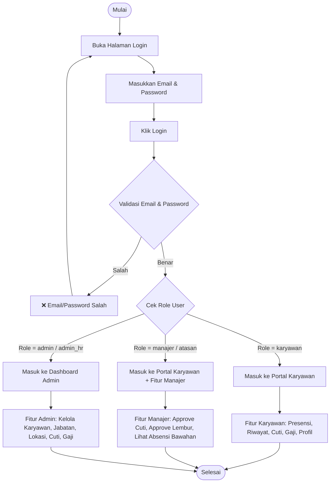

# 🔐 Alur Login Berdasarkan Role (Karyawan, Manajer, Admin)

---

## 📊 Diagram Flowchart Login Lengkap



---

## 🔍 Penjelasan Detail Setiap Role

### 1. 👤 Role: KARYAWAN

#### Flow Login:
1. **Buka halaman login**
2. **Masukkan email & password**
3. **Klik login**
4. **Sistem verifikasi**: Email terdaftar & password cocok?
5. **Sukses**: Redirect ke `/portal/home` (Portal Karyawan)

#### Fitur yang Bisa Diakses:
- 🏠 **Home**: Lihat ringkasan absensi hari ini
- ✅ **Presensi**: Check In / Check Out
- 📋 **Riwayat Absensi**: Lihat semua riwayat absensi pribadi
- 📅 **Cuti**: Lihat saldo cuti & ajukan cuti
- 💰 **Gaji**: Lihat slip gaji
- 👤 **Profil**: Lihat & edit profil, ubah password
- 📝 **Persetujuan**: Setujui perjanjian absensi

---

### 2. 👔 Role: MANAJER / ATASAN

#### Flow Login:
1. **Buka halaman login**
2. **Masukkan email & password**
3. **Klik login**
4. **Sistem verifikasi**: Email terdaftar & password cocok?
5. **Sukses**: Redirect ke `/portal/home` (sama dengan karyawan, tapi ada fitur tambahan)

#### Fitur Tambahan Manajer:
Selain semua fitur karyawan, manajer juga bisa:
- ✅ **Approval Cuti**: Melihat & menyetujui/menolak pengajuan cuti bawahan
- ✅ **Approval Lembur**: Melihat & menyetujui/menolak pengajuan lembur bawahan
- 📊 **Lihat Absensi Bawahan**: Melihat riwayat absensi semua karyawan di bawahnya
- 📈 **Dashboard Manajer**: Statistik timnya

---

### 3. 🛠️ Role: ADMIN / ADMIN_HR

#### Flow Login:
1. **Buka halaman login**
2. **Masukkan email & password**
3. **Klik login**
4. **Sistem verifikasi**: Email terdaftar & password cocok?
5. **Sukses**: Redirect ke `/` (Dashboard Admin)

#### Fitur Admin Lengkap:
- 👥 **Kelola Karyawan**: Tambah, edit, hapus data karyawan
- 📊 **Kelola Master Data**:
  - Jabatan
  - Departemen
  - Golongan
  - Pangkat
  - Status Karyawan
  - Unit Kerja
- 📍 **Kelola Lokasi Absensi**: Tambah titik lokasi absensi dengan radius
- 📅 **Kelola Cuti**: Lihat semua pengajuan cuti, setujui/tolak
- 💰 **Kelola Gaji**: Generate slip gaji, kelola riwayat gaji
- 📋 **Kelola Absensi**: Lihat semua riwayat absensi semua karyawan
- 📅 **Kelola Hari Libur**: Tambah hari libur nasional
- 🔄 **Kelola Shift & Jadwal**: Atur shift kerja dan jadwal karyawan

---

## 📂 Kode Implementasi

Bisa dilihat di: [LoginController.php](file:///c:/xampp/htdocs/Aplikasi%20HR%20Karyawan/app/Http/Controllers/LoginController.php#L88-L95)

```php
protected function redirectAfterLogin($user)
{
    // Jika role adalah karyawan atau manajer, redirect ke portal
    if (in_array($user->role ?? 'karyawan', ['karyawan', 'manajer'], true)) {
        return redirect()->route('portal.home');
    }

    // Selain itu (admin), redirect ke dashboard admin
    return redirect()->route('index');
}
```

---

## 🎯 Tabel Ringkasan Role & Hak Akses

| Fitur | Karyawan | Manajer | Admin |
|-------|----------|---------|-------|
| Presensi Pribadi | ✅ | ✅ | ❌ |
| Lihat Profil Sendiri | ✅ | ✅ | ✅ |
| Ubah Password | ✅ | ✅ | ✅ |
| Ajukan Cuti | ✅ | ✅ | ❌ |
| Lihat Saldo Cuti | ✅ | ✅ | ❌ |
| Lihat Slip Gaji | ✅ | ✅ | ❌ |
| Approve Cuti Bawahan | ❌ | ✅ | ✅ |
| Approve Lembur Bawahan | ❌ | ✅ | ✅ |
| Lihat Absensi Bawahan | ❌ | ✅ | ✅ |
| Kelola Data Karyawan | ❌ | ❌ | ✅ |
| Kelola Lokasi Absensi | ❌ | ❌ | ✅ |
| Kelola Master Data | ❌ | ❌ | ✅ |
| Generate Slip Gaji | ❌ | ❌ | ✅ |
