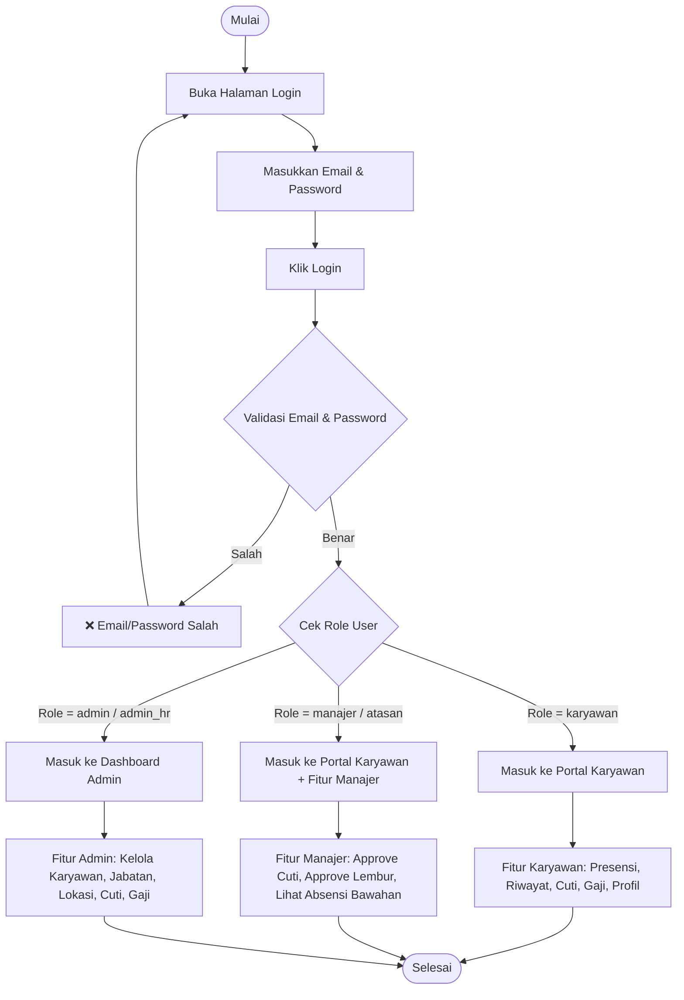
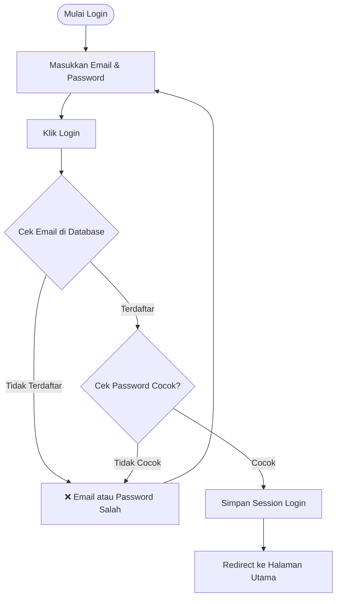
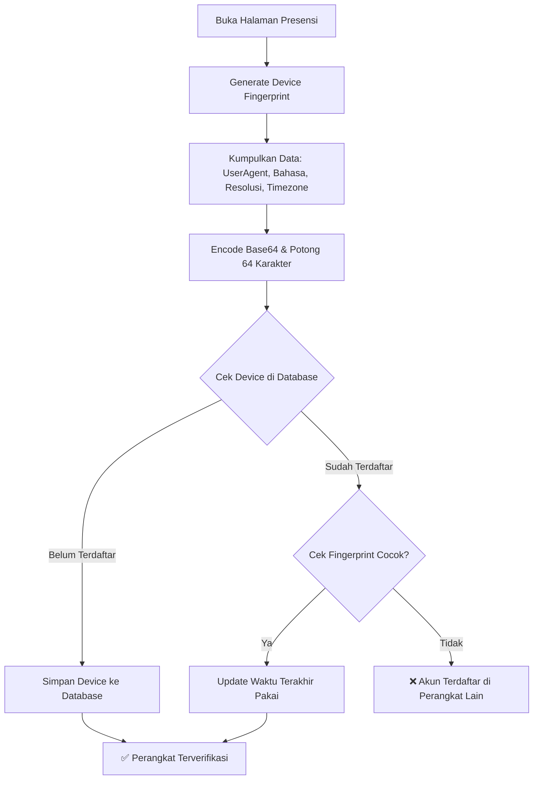
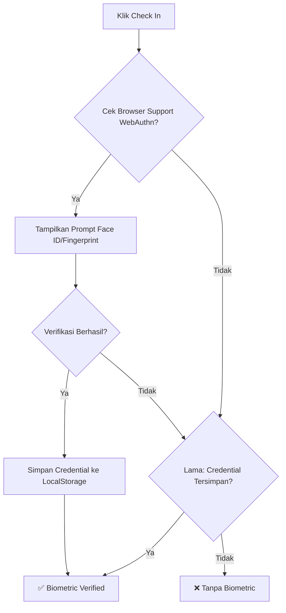
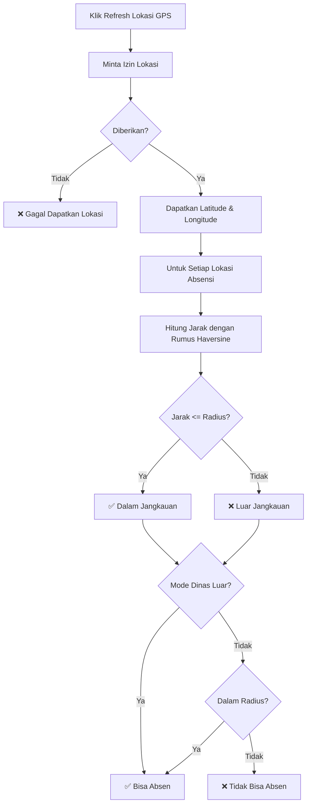
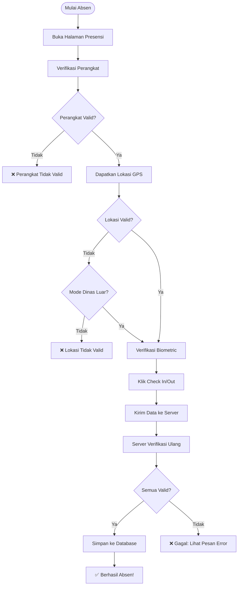
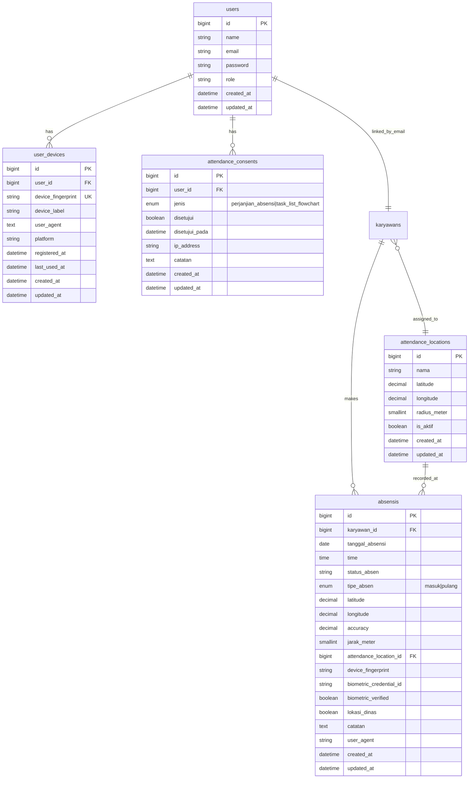

# 📚 Dokumentasi Lengkap SmartHR

Semua alur, diagram, dan penjelasan dalam satu file!

---

## 📑 Daftar Isi:
1. [Alur Login Berdasarkan Role](#1-alur-login-berdasarkan-role-karyawan-manajer-admin)
2. [Alur Autentikasi dan Keamanan](#2-alur-autentikasi-dan-keamanan)
3. [Alur Device Binding dan Fingerprint](#3-alur-device-binding-dan-fingerprint)
4. [Alur Verifikasi Biometrik (Face ID / Fingerprint)](#4-alur-verifikasi-biometrik-face-id--fingerprint)
5. [Alur Pemetaan Lokasi Absensi (Geofencing)](#5-alur-pemetaan-lokasi-absensi-geofencing)
6. [Alur Absensi Lengkap (End-to-End)](#6-alur-absensi-lengkap-end-to-end)
7. [Skema Database (Tabel Terkait)](#7-skema-database-tabel-terkait)
8. [Ringkasan Fitur Keamanan](#8-ringkasan-fitur-keamanan)
9. [Tabel Hak Akses Role](#9-tabel-ringkasan-role--hak-akses)

---

## 1. Alur Login Berdasarkan Role (Karyawan, Manajer, Admin)

### Diagram Flowchart Login Lengkap


### Penjelasan Detail Setiap Role

#### 1. 👤 Role: KARYAWAN
##### Flow Login:
1. Buka halaman login
2. Masukkan email & password
3. Klik login
4. Sistem verifikasi: Email terdaftar & password cocok?
5. Sukses: Redirect ke `/portal/home` (Portal Karyawan)

##### Fitur yang Bisa Diakses:
- 🏠 Home: Lihat ringkasan absensi hari ini
- ✅ Presensi: Check In / Check Out
- 📋 Riwayat Absensi: Lihat semua riwayat absensi pribadi
- 📅 Cuti: Lihat saldo cuti & ajukan cuti
- 💰 Gaji: Lihat slip gaji
- 👤 Profil: Lihat & edit profil, ubah password
- 📝 Persetujuan: Setujui perjanjian absensi

---

#### 2. 👔 Role: MANAJER / ATASAN
##### Flow Login:
1. Buka halaman login
2. Masukkan email & password
3. Klik login
4. Sistem verifikasi: Email terdaftar & password cocok?
5. Sukses: Redirect ke `/portal/home` (sama dengan karyawan, tapi ada fitur tambahan)

##### Fitur Tambahan Manajer:
Selain semua fitur karyawan, manajer juga bisa:
- ✅ Approval Cuti: Melihat & menyetujui/menolak pengajuan cuti bawahan
- ✅ Approval Lembur: Melihat & menyetujui/menolak pengajuan lembur bawahan
- 📊 Lihat Absensi Bawahan: Melihat riwayat absensi semua karyawan di bawahnya
- 📈 Dashboard Manajer: Statistik timnya

---

#### 3. 🛠️ Role: ADMIN / ADMIN_HR
##### Flow Login:
1. Buka halaman login
2. Masukkan email & password
3. Klik login
4. Sistem verifikasi: Email terdaftar & password cocok?
5. Sukses: Redirect ke `/` (Dashboard Admin)

##### Fitur Admin Lengkap:
- 👥 Kelola Karyawan: Tambah, edit, hapus data karyawan
- 📊 Kelola Master Data: Jabatan, Departemen, Golongan, Pangkat, Status Karyawan, Unit Kerja
- 📍 Kelola Lokasi Absensi: Tambah titik lokasi absensi dengan radius
- 📅 Kelola Cuti: Lihat semua pengajuan cuti, setujui/tolak
- 💰 Kelola Gaji: Generate slip gaji, kelola riwayat gaji
- 📋 Kelola Absensi: Lihat semua riwayat absensi semua karyawan
- 📅 Kelola Hari Libur: Tambah hari libur nasional
- 🔄 Kelola Shift & Jadwal: Atur shift kerja dan jadwal karyawan

---

### Kode Implementasi Login
Bisa dilihat di: [LoginController.php](file:///c:/xampp/htdocs/Aplikasi%20HR%20Karyawan/app/Http/Controllers/LoginController.php#L88-L95)
```php
protected function redirectAfterLogin($user)
{
    // Jika role adalah karyawan atau manajer, redirect ke portal
    if (in_array($user->role ?? 'karyawan', ['karyawan', 'manajer'], true)) {
        return redirect()->route('portal.home');
    }
    // Selain itu (admin), redirect ke dashboard admin
    return redirect()->route('index');
}
```

---

## 2. Alur Autentikasi dan Keamanan



### Detail Keamanan Password:
- **Hashing**: Menggunakan Laravel Hash (Bcrypt/Argon2)
- **Enkripsi**: Password tidak pernah disimpan dalam bentuk plain text
- **Verifikasi**: Hash::check() membandingkan password input dengan hash di database

---

## 3. Alur Device Binding dan Fingerprint



### Komponen Fingerprint:
- **User Agent**: Informasi browser dan OS
- **Bahasa**: Bahasa browser
- **Resolusi Layar**: Lebar x tinggi dan color depth
- **Zona Waktu**: Timezone browser

---

## 4. Alur Verifikasi Biometrik (Face ID / Fingerprint)



### Detail WebAuthn:
- **Protokol**: Web Authentication (WebAuthn) API
- **Autentikator**: Platform (Touch ID, Face ID, Windows Hello)
- **User Verification**: Diwajibkan (userVerification: 'required')
- **Algoritme**: ES256 (alg: -7)

---

## 5. Alur Pemetaan Lokasi Absensi (Geofencing)



### Rumus Haversine (Jarak antara 2 titik):
```
R = radius bumi (6371000 meter)
dLat = (lat2 - lat1) × π/180
dLon = (lon2 - lon1) × π/180
a = sin²(dLat/2) + cos(lat1) × cos(lat2) × sin²(dLon/2)
c = 2 × atan2(√a, √(1-a))
jarak = R × c
```

---

## 6. Alur Absensi Lengkap (End-to-End)



---

## 7. Skema Database (Tabel Terkait)



---

## 8. Ringkasan Fitur Keamanan

1. **Autentikasi**:
   - Login email/password dengan Laravel Auth
   - Password di-hash dengan Bcrypt/Argon2
   - Session-based authentication

2. **Device Binding**:
   - Satu akun hanya bisa dipakai di satu perangkat
   - Fingerprint di-generate dari karakteristik browser/device
   - Penyimpanan last_used_at untuk audit

3. **Biometric Verification**:
   - WebAuthn API untuk Face ID / Fingerprint / Windows Hello
   - Fallback ke stored credential jika WebAuthn tidak didukung
   - User verification diwajibkan

4. **Geofencing**:
   - Verifikasi lokasi dengan GPS (enableHighAccuracy)
   - Rumus Haversine untuk perhitungan jarak
   - Backend double-check untuk keamanan
   - Mode dinas luar untuk pengecualian lokasi

5. **Data Integrity**:
   - Semua metadata absensi disimpan (lat, lng, accuracy, device_fingerprint, biometric, user_agent)
   - Attendance consent sebelum absensi diizinkan

---

## 9. Tabel Ringkasan Role & Hak Akses

| Fitur | Karyawan | Manajer | Admin |
|-------|----------|---------|-------|
| Presensi Pribadi | ✅ | ✅ | ❌ |
| Lihat Profil Sendiri | ✅ | ✅ | ✅ |
| Ubah Password | ✅ | ✅ | ✅ |
| Ajukan Cuti | ✅ | ✅ | ❌ |
| Lihat Saldo Cuti | ✅ | ✅ | ❌ |
| Lihat Slip Gaji | ✅ | ✅ | ❌ |
| Approve Cuti Bawahan | ❌ | ✅ | ✅ |
| Approve Lembur Bawahan | ❌ | ✅ | ✅ |
| Lihat Absensi Bawahan | ❌ | ✅ | ✅ |
| Kelola Data Karyawan | ❌ | ❌ | ✅ |
| Kelola Lokasi Absensi | ❌ | ❌ | ✅ |
| Kelola Master Data | ❌ | ❌ | ✅ |
| Generate Slip Gaji | ❌ | ❌ | ✅ |

---

## 📂 Referensi File Kode:
- [LoginController.php](file:///c:/xampp/htdocs/Aplikasi%20HR%20Karyawan/app/Http/Controllers/LoginController.php)
- [DeviceBindingService.php](file:///c:/xampp/htdocs/Aplikasi%20HR%20Karyawan/app/Services/DeviceBindingService.php)
- [GeolocationService.php](file:///c:/xampp/htdocs/Aplikasi%20HR%20Karyawan/app/Support/GeolocationService.php)
- [PortalController.php](file:///c:/xampp/htdocs/Aplikasi%20HR%20Karyawan/app/Http/Controllers/PortalController.php)
- [Migrasi Database](file:///c:/xampp/htdocs/Aplikasi%20HR%20Karyawan/database/migrations/2026_05_16_100000_add_portal_attendance_features.php)
