# ERD — Database `hr_hr`

Entity Relationship Diagram berdasarkan dump `hr_hr.sql` (MariaDB, Jun 2026).

Dirender di VS Code, GitHub, atau [mermaid.live](https://mermaid.live).

## Daftar Isi

1. [Gambaran Umum](#1-gambaran-umum)
2. [Autentikasi & Portal](#2-autentikasi--portal)
3. [Master Data HR](#3-master-data-hr)
4. [Karyawan (Entitas Pusat)](#4-karyawan-entitas-pusat)
5. [Presensi & Lokasi](#5-presensi--lokasi)
6. [Cuti & Saldo Cuti](#6-cuti--saldo-cuti)
7. [Jadwal Kerja](#7-jadwal-kerja)
8. [Payroll & Gaji](#8-payroll--gaji)
9. [Lembur & Reimbursement](#9-lembur--reimbursement)
10. [Wilayah Indonesia](#10-wilayah-indonesia)
11. [Tabel Sistem (Laravel)](#11-tabel-sistem-laravel)
12. [Relasi Logis (Tanpa FK)](#12-relasi-logis-tanpa-fk)

---

## Legenda

| Simbol | Arti |
|--------|------|
| `PK` | Primary Key |
| `FK` | Foreign Key (ada di database) |
| `||--o{` | Satu ke banyak (1:N) |
| `||--||` | Satu ke satu (1:1) |
| `}o--o{` | Banyak ke banyak (N:M) via tabel penghubung |

---

## 1. Gambaran Umum

Diagram ringkas hubungan antar modul utama.

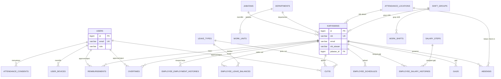

> **Catatan:** `users` dan `karyawans` dihubungkan aplikasi lewat **email** (bukan FK di database).

---

## 2. Autentikasi & Portal

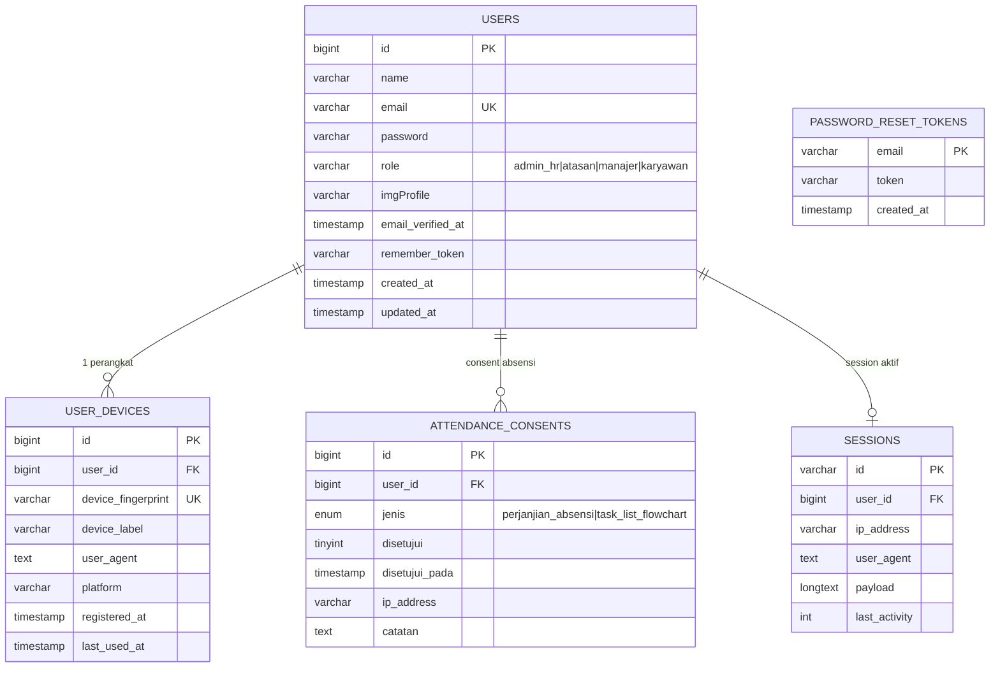

---

## 3. Master Data HR

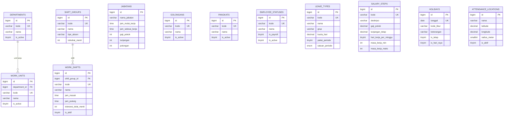

---

## 4. Karyawan (Entitas Pusat)

Tabel `karyawans` memiliki 80+ kolom. Diagram ini menampilkan kolom kunci dan relasi FK.

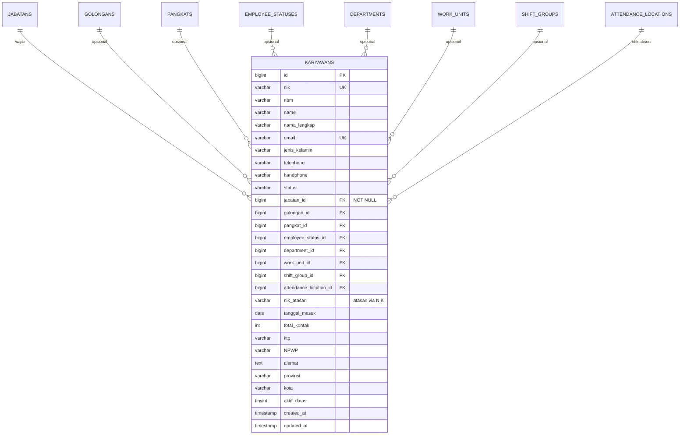

### Hierarki Atasan (logis, tanpa FK)

```mermaid
erDiagram
    KARYAWANS ||--o{ KARYAWANS : "nik_atasan → nik"

    KARYAWANS {
        varchar nik PK
        varchar nik_atasan FK_logis
        varchar name
    }
```

---

## 5. Presensi & Lokasi

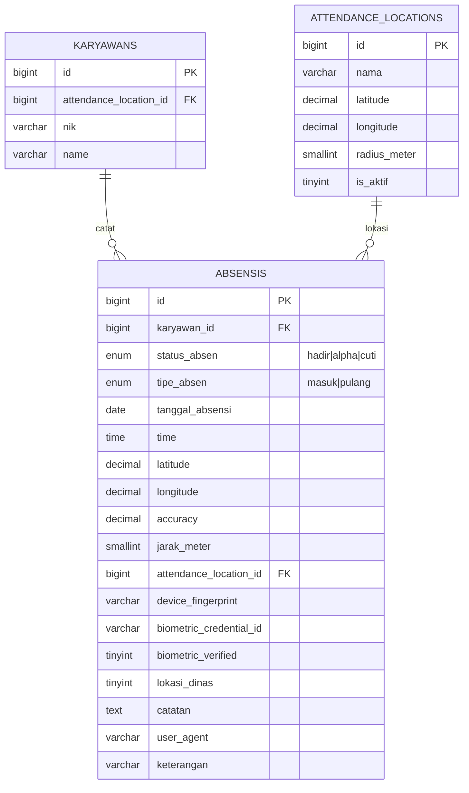

---

## 6. Cuti & Saldo Cuti

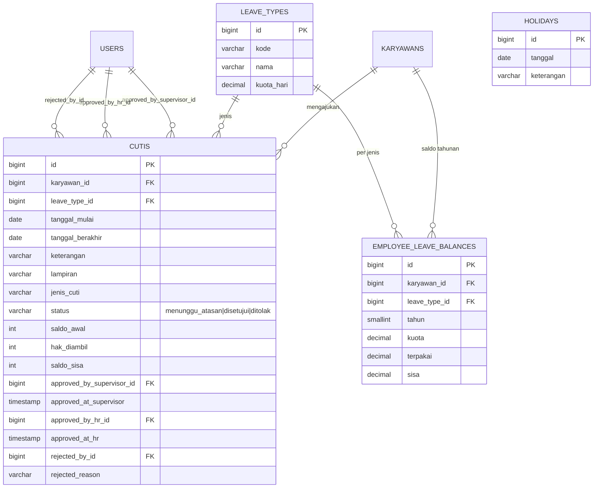

> `holidays` tidak punya FK ke `cutis`, tetapi dipakai aplikasi untuk menghitung hari kerja saat pengajuan cuti.

---

## 7. Jadwal Kerja

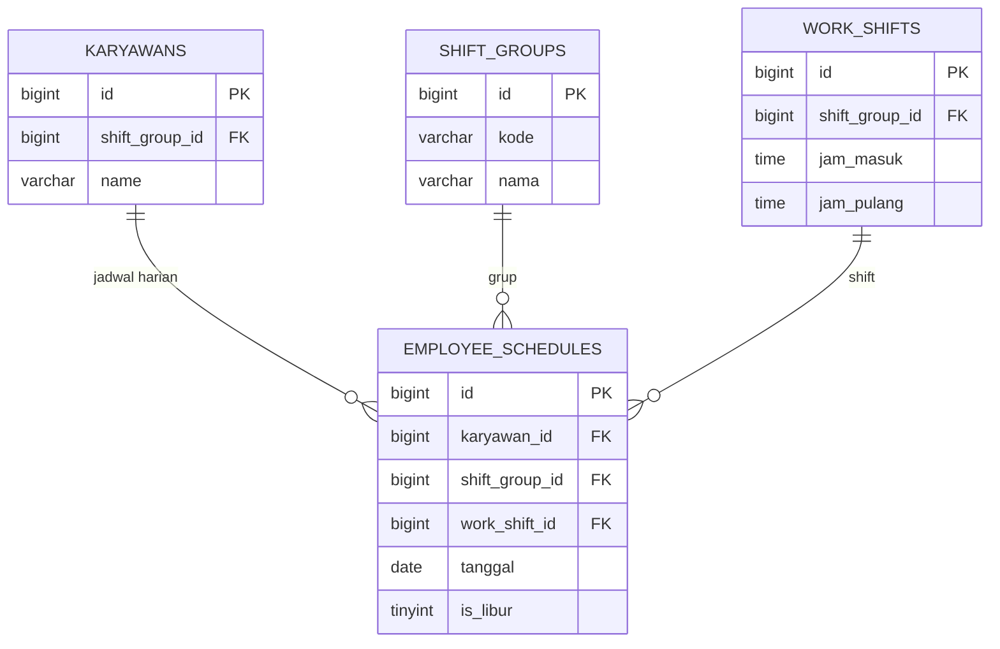

---

## 8. Payroll & Gaji

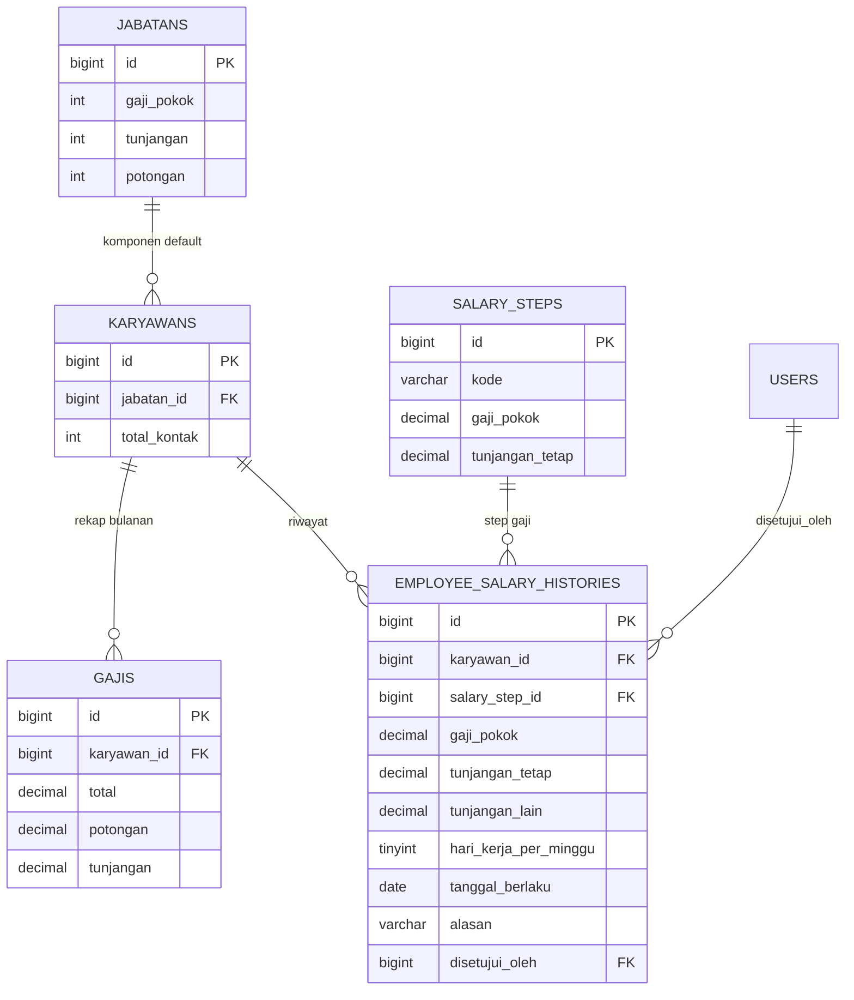

---

## 9. Lembur & Reimbursement

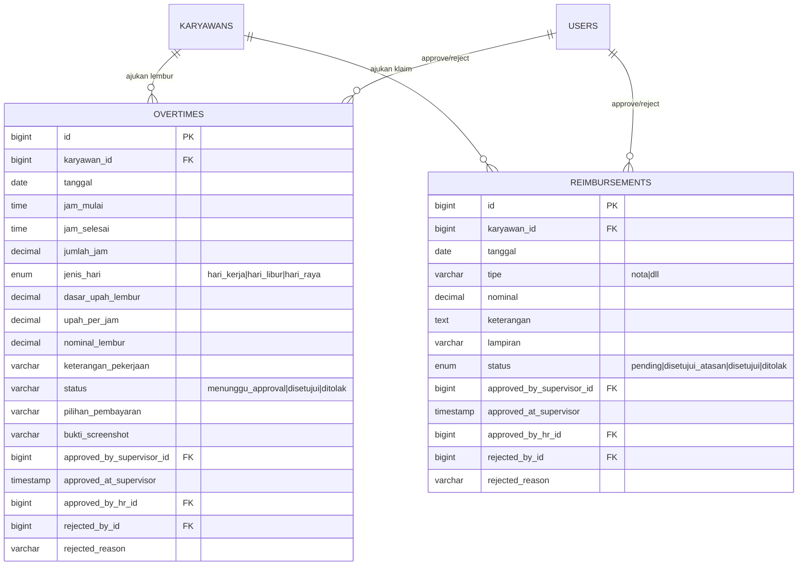

---

## 10. Wilayah Indonesia

Data referensi alamat (tidak terhubung FK ke `karyawans`; karyawan menyimpan nama wilayah sebagai teks).

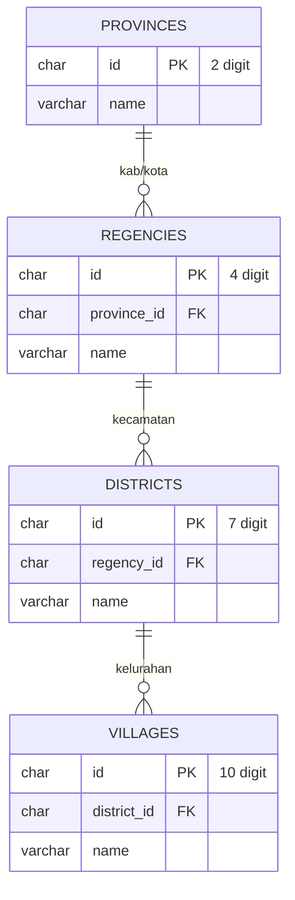

---

## 11. Tabel Sistem (Laravel)

Tabel infrastruktur framework — tidak terkait logika bisnis HR.

| Tabel | Fungsi |
|-------|--------|
| `migrations` | Riwayat migrasi database |
| `cache` / `cache_locks` | Cache aplikasi |
| `jobs` / `job_batches` / `failed_jobs` | Antrian background job |
| `sessions` | Session login web |
| `password_reset_tokens` | Reset password |

---

## 12. Relasi Logis (Tanpa FK)

Relasi ini dipakai aplikasi tetapi **tidak didefinisikan sebagai foreign key** di database.

| Dari | Ke | Cara Hubung | Kegunaan |
|------|----|-------------|----------|
| `users.email` | `karyawans.email` | Match string | Login portal ↔ data pegawai |
| `karyawans.nik_atasan` | `karyawans.nik` | Self-reference | Hierarki atasan–bawahan |
| `karyawans.provinsi/kota/...` | `provinces/regencies/...` | Nama teks (bukan ID) | Alamat pegawai |
| `holidays.tanggal` | perhitungan cuti | Query tanggal | Exclude hari libur |

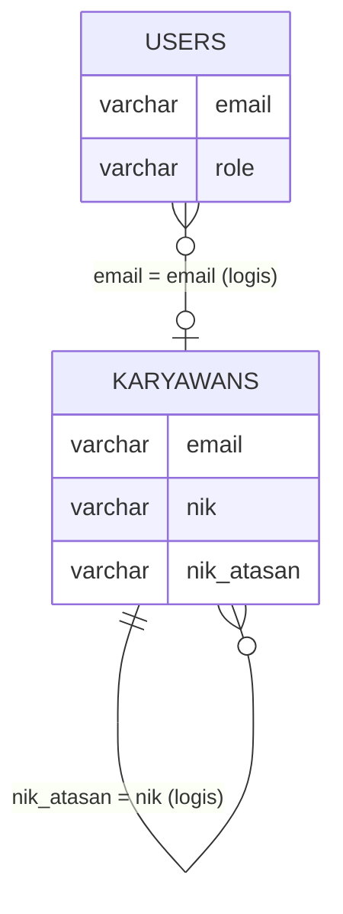

---

## Ringkasan Tabel (36 tabel)

| Grup | Tabel |
|------|-------|
| **Auth** | `users`, `user_devices`, `attendance_consents`, `sessions`, `password_reset_tokens` |
| **Master HR** | `jabatans`, `golongans`, `pangkats`, `employee_statuses`, `departments`, `work_units`, `shift_groups`, `work_shifts`, `leave_types`, `salary_steps`, `holidays`, `attendance_locations` |
| **Pegawai** | `karyawans`, `employee_employment_histories` |
| **Operasional** | `absensis`, `cutis`, `employee_leave_balances`, `employee_schedules`, `overtimes`, `reimbursements`, `gajis`, `employee_salary_histories` |
| **Wilayah** | `provinces`, `regencies`, `districts`, `villages` |
| **Sistem** | `migrations`, `cache`, `cache_locks`, `jobs`, `job_batches`, `failed_jobs` |

---

## Daftar Foreign Key (Database)

| Tabel Anak | Kolom FK | Tabel Induk |
|------------|----------|-------------|
| `absensis` | `karyawan_id` | `karyawans` |
| `absensis` | `attendance_location_id` | `attendance_locations` |
| `attendance_consents` | `user_id` | `users` |
| `cutis` | `karyawan_id` | `karyawans` |
| `cutis` | `leave_type_id` | `leave_types` |
| `cutis` | `approved_by_supervisor_id` | `users` |
| `cutis` | `approved_by_hr_id` | `users` |
| `cutis` | `rejected_by_id` | `users` |
| `districts` | `regency_id` | `regencies` |
| `employee_employment_histories` | `karyawan_id` | `karyawans` |
| `employee_leave_balances` | `karyawan_id` | `karyawans` |
| `employee_leave_balances` | `leave_type_id` | `leave_types` |
| `employee_salary_histories` | `karyawan_id` | `karyawans` |
| `employee_salary_histories` | `salary_step_id` | `salary_steps` |
| `employee_salary_histories` | `disetujui_oleh` | `users` |
| `employee_schedules` | `karyawan_id` | `karyawans` |
| `employee_schedules` | `shift_group_id` | `shift_groups` |
| `employee_schedules` | `work_shift_id` | `work_shifts` |
| `gajis` | `karyawan_id` | `karyawans` |
| `karyawans` | `jabatan_id` | `jabatans` |
| `karyawans` | `golongan_id` | `golongans` |
| `karyawans` | `pangkat_id` | `pangkats` |
| `karyawans` | `employee_status_id` | `employee_statuses` |
| `karyawans` | `department_id` | `departments` |
| `karyawans` | `work_unit_id` | `work_units` |
| `karyawans` | `shift_group_id` | `shift_groups` |
| `karyawans` | `attendance_location_id` | `attendance_locations` |
| `overtimes` | `karyawan_id` | `karyawans` |
| `overtimes` | `approved_by_supervisor_id` | `users` |
| `overtimes` | `approved_by_hr_id` | `users` |
| `overtimes` | `rejected_by_id` | `users` |
| `regencies` | `province_id` | `provinces` |
| `reimbursements` | `karyawan_id` | `karyawans` |
| `reimbursements` | `approved_by_supervisor_id` | `users` |
| `reimbursements` | `approved_by_hr_id` | `users` |
| `reimbursements` | `rejected_by_id` | `users` |
| `user_devices` | `user_id` | `users` |
| `villages` | `district_id` | `districts` |
| `work_shifts` | `shift_group_id` | `shift_groups` |
| `work_units` | `department_id` | `departments` |

---

*Sumber: `hr_hr.sql` — phpMyAdmin dump, 22 Jun 2026*
