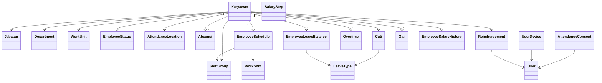
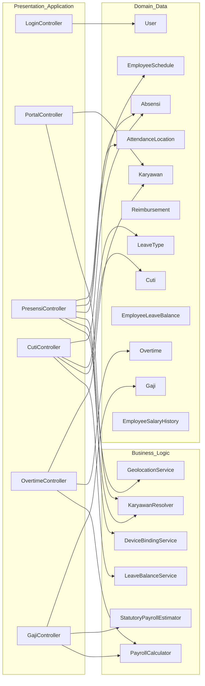
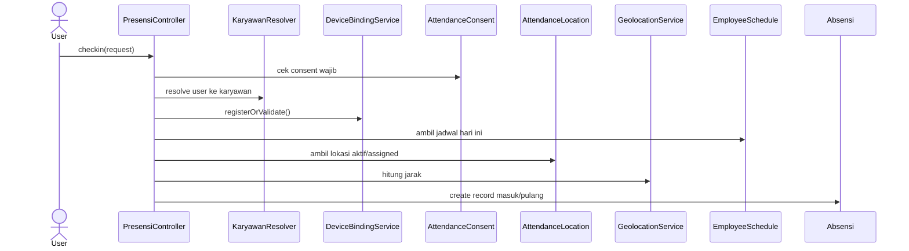
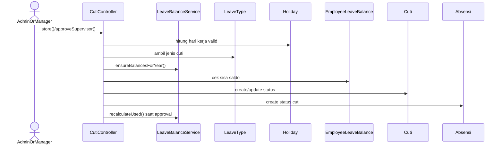

# Reverse Engineering OOP — Aplikasi HR Karyawan

Dokumen ini memetakan struktur OOP aplikasi `Aplikasi HR Karyawan` berdasarkan implementasi aktual pada codebase Laravel 11. Fokus analisis adalah relasi kelas, pembagian tanggung jawab objek, alur interaksi runtime, dan pola desain yang muncul dari kode.

## 1. Gambaran Umum Arsitektur

Aplikasi ini dibangun dengan Laravel 11 dan menggunakan pendekatan yang dominan berupa:

- `Controller` sebagai orchestration layer
- `Eloquent Model` sebagai domain/data layer aktif
- `Service` sebagai business workflow layer terbatas
- `Support` sebagai helper/perhitungan bisnis lintas modul

Secara praktik, struktur OOP aplikasi ini lebih dekat ke pola `Active Record + Service/Helper` daripada domain model murni.

## 2. Lapisan OOP Aplikasi

### 2.1 Presentation / Application Layer

Lapisan ini bertanggung jawab menerima request, memvalidasi input, mengorkestrasi model/service, lalu mengembalikan view atau response JSON.

Kelas utama:

- `app/Http/Controllers/LoginController.php`
- `app/Http/Controllers/Dashboard.php`
- `app/Http/Controllers/PortalController.php`
- `app/Http/Controllers/PresensiController.php`
- `app/Http/Controllers/CutiController.php`
- `app/Http/Controllers/ReimbursementController.php`
- `app/Http/Controllers/OvertimeController.php`
- `app/Http/Controllers/GajiController.php`
- controller CRUD master seperti `KaryawanController`, `JabatanController`, `DepartmentController`, `WorkShiftController`, dan lainnya

Karakteristik lapisan ini:

- boundary modul ditentukan dari route di `routes/web.php`
- controller menangani validasi request dan pengambilan keputusan alur
- business rule tidak sepenuhnya dipindah ke domain/service, sehingga beberapa controller masih cukup tebal

### 2.2 Domain / Data Layer

Lapisan ini direpresentasikan oleh Eloquent model di `app/Models`. Model berfungsi sebagai:

- representasi entitas bisnis
- pintu akses relasi antar entitas
- penyimpan state transaksi dan master data

Model inti:

- `Karyawan`
- `Absensi`
- `Cuti`
- `Overtime`
- `Reimbursement`
- `Gaji`
- `LeaveType`
- `EmployeeLeaveBalance`
- `EmployeeSchedule`
- `AttendanceLocation`
- `EmployeeSalaryHistory`
- `SalaryStep`

### 2.3 Business Logic Layer

Lapisan ini berisi aturan bisnis yang diekstrak dari controller atau model.

Service:

- `app/Services/LeaveBalanceService.php`
- `app/Services/DeviceBindingService.php`
- `app/Services/HolidaySyncService.php`

Support:

- `app/Support/PayrollCalculator.php`
- `app/Support/StatutoryPayrollEstimator.php`
- `app/Support/GeolocationService.php`
- `app/Support/KaryawanResolver.php`

### 2.4 Infrastructure / Reference Layer

Lapisan ini berisi referensi pendukung dan integrasi lookup:

- model wilayah: `Province`, `Regency`, `District`, `Village`
- hari libur nasional: `Holiday`
- user autentikasi: `User`
- persetujuan dan perangkat: `AttendanceConsent`, `UserDevice`

## 3. Boundary Modul Berdasarkan Route

Boundary modul paling jelas ditentukan oleh `routes/web.php`.

| Modul | Prefix / Route Utama | Controller Utama |
|---|---|---|
| Autentikasi | `/`, `/actionlogout`, `/actionAdminUpdate` | `LoginController` |
| Dashboard Admin | `/dashboard`, `/profile` | `Dashboard` |
| Portal Karyawan/Manager | `/portal/*` | `PortalController`, `PresensiController`, `ReimbursementController` |
| Master Pegawai | `/karyawans*` | `KaryawanController` |
| Master Organisasi | `/jabatans`, `/golongans*`, `/pangkats*`, `/employee-statuses*`, `/departments*`, `/work-units*` | controller CRUD master |
| Absensi dan Jadwal | `/absensi*`, `/attendance-locations*`, `/shift-groups*`, `/work-shifts*`, `/employee-schedules*`, `/holidays*` | `AbsensiController`, `AttendanceLocationController`, `WorkShiftController`, `HolidayController`, `EmployeeScheduleController` |
| Cuti | `/cuti*`, `/leave-types*`, `/leave-balances*` | `CutiController`, `LeaveTypeController`, `LeaveBalanceController` |
| Lembur, Klaim, Gaji | `/overtimes*`, `/reimbursements*`, `/salary-steps*`, `/salary-histories*`, `/gajis` | `OvertimeController`, `ReimbursementController`, `SalaryStepController`, `EmployeeSalaryHistoryController`, `GajiController` |
| Lookup Wilayah | `/indonesia/*` | `IndonesiaController` |

## 4. Struktur Domain dan Cluster Kelas

## 4.1 Core HR Master Data

Pusat domain aplikasi berada pada entitas `Karyawan`.

File utama:

- `app/Models/Karyawan.php`
- `app/Models/Jabatan.php`
- `app/Models/Golongan.php`
- `app/Models/Pangkat.php`
- `app/Models/EmployeeStatus.php`
- `app/Models/Department.php`
- `app/Models/WorkUnit.php`
- `app/Models/EmployeeEmploymentHistory.php`

Peran `Karyawan`:

- menjadi pusat identitas pegawai
- menghubungkan pegawai ke jabatan, unit kerja, status, shift, lokasi absensi, dan supervisor
- menjadi root relasi ke absensi, cuti, gaji, lembur, jadwal, salary history, dan leave balance

Relasi eksplisit penting pada `Karyawan`:

- `belongsTo(Jabatan)`
- `belongsTo(Golongan)`
- `belongsTo(Pangkat)`
- `belongsTo(EmployeeStatus)`
- `belongsTo(Department)`
- `belongsTo(WorkUnit)`
- `belongsTo(ShiftGroup)`
- `belongsTo(AttendanceLocation)`
- `hasMany(EmployeeEmploymentHistory)`
- `hasMany(Absensi)`
- `hasMany(Cuti)`
- `hasMany(Gaji)`
- `hasMany(EmployeeSchedule)`
- `hasMany(Overtime)`
- `hasMany(EmployeeSalaryHistory)`
- `hasMany(EmployeeLeaveBalance)`

Catatan OOP:

- `Karyawan` bertindak sebagai aggregate root konseptual
- `User` tidak memiliki foreign key langsung ke `Karyawan`; pemetaan dilakukan via email menggunakan `KaryawanResolver`
- hubungan atasan-bawahan dimodelkan secara sederhana lewat atribut `nik_atasan`, bukan association table khusus

## 4.2 Attendance and Scheduling Cluster

File utama:

- `app/Models/Absensi.php`
- `app/Models/AttendanceLocation.php`
- `app/Models/ShiftGroup.php`
- `app/Models/WorkShift.php`
- `app/Models/EmployeeSchedule.php`
- `app/Models/AttendanceConsent.php`
- `app/Models/UserDevice.php`
- `app/Support/GeolocationService.php`
- `app/Services/DeviceBindingService.php`

Peran objek:

- `Absensi`: transaksi kehadiran aktual
- `AttendanceLocation`: titik geofence presensi
- `ShiftGroup` dan `WorkShift`: struktur jadwal kerja
- `EmployeeSchedule`: penugasan shift ke karyawan pada tanggal tertentu
- `AttendanceConsent`: penyimpanan persetujuan syarat presensi
- `UserDevice`: binding satu akun ke satu perangkat
- `GeolocationService`: utility jarak lokasi
- `DeviceBindingService`: workflow registrasi/validasi perangkat

Catatan OOP:

- `PresensiController` menjadi orchestration center untuk validasi presensi
- `GeolocationService` dan `DeviceBindingService` adalah dependency penting yang menandakan extraction business rule sudah mulai dilakukan
- logika verifikasi consent masih berada di dalam controller, bukan domain/service khusus

## 4.3 Leave Management Cluster

File utama:

- `app/Models/Cuti.php`
- `app/Models/LeaveType.php`
- `app/Models/EmployeeLeaveBalance.php`
- `app/Models/Holiday.php`
- `app/Services/LeaveBalanceService.php`

Peran objek:

- `Cuti`: entitas transaksi pengajuan cuti
- `LeaveType`: master jenis cuti dan kuota default
- `EmployeeLeaveBalance`: state saldo cuti pegawai per tahun dan per jenis
- `Holiday`: referensi hari libur nasional
- `LeaveBalanceService`: pengelola lifecycle saldo cuti

Catatan OOP:

- `LeaveBalanceService` adalah salah satu contoh service yang paling jelas tanggung jawabnya
- `CutiController` masih menyimpan cukup banyak domain workflow, seperti menghitung hari kerja, membuat record cuti, dan membuat efek samping ke `Absensi`
- ada coupling konseptual antara `Cuti` dan `Absensi`, karena pengajuan cuti juga menghasilkan data absensi bertipe `cuti`

## 4.4 Payroll and Compensation Cluster

File utama:

- `app/Models/Gaji.php`
- `app/Models/Overtime.php`
- `app/Models/Reimbursement.php`
- `app/Models/SalaryStep.php`
- `app/Models/EmployeeSalaryHistory.php`
- `app/Support/PayrollCalculator.php`
- `app/Support/StatutoryPayrollEstimator.php`

Peran objek:

- `Gaji`: record gaji dan basis tampilan payroll bulanan
- `Overtime`: transaksi lembur dengan nominal hasil kalkulasi
- `Reimbursement`: transaksi klaim penggantian biaya
- `SalaryStep`: master skala gaji
- `EmployeeSalaryHistory`: histori komponen gaji pegawai
- `PayrollCalculator`: policy object untuk kalkulasi lembur
- `StatutoryPayrollEstimator`: estimator BPJS dan PPh21 sederhana

Catatan OOP:

- aturan payroll paling besar justru berada di `PayrollCalculator`, bukan di model `Gaji`
- `GajiController` bertindak seperti read-model composer: mengambil data lalu menempelkan atribut hasil perhitungan ke objek `Gaji`
- `OvertimeController` dan `PayrollCalculator` membentuk pasangan controller-policy yang cukup jelas

## 4.5 Reference and Lookup Cluster

File utama:

- `app/Models/Province.php`
- `app/Models/Regency.php`
- `app/Models/District.php`
- `app/Models/Village.php`
- `app/Http/Controllers/IndonesiaController.php`

Cluster ini bersifat pendukung dan tidak menjadi pusat domain bisnis, tetapi penting untuk formulir alamat karyawan.

## 5. Tanggung Jawab Kelas-Kelas Kunci

| Kelas | Tanggung Jawab Utama | Jenis |
|---|---|---|
| `Karyawan` | pusat identitas pegawai dan hub relasi domain | Model |
| `PresensiController` | orkestrasi presensi portal, consent, device, geo-fence, dan create `Absensi` | Controller |
| `CutiController` | workflow pengajuan, perubahan, persetujuan, dan penolakan cuti | Controller |
| `OvertimeController` | validasi kuota dan approval lembur | Controller |
| `GajiController` | komposisi tampilan payroll bulanan | Controller |
| `LeaveBalanceService` | generate, sinkronisasi, dan recalculation saldo cuti | Service |
| `DeviceBindingService` | enforce satu perangkat per user | Service |
| `HolidaySyncService` | sinkronisasi hari libur dari sumber eksternal | Service |
| `PayrollCalculator` | kalkulasi salary components, dasar lembur, upah/jam, kuota mingguan, nominal lembur | Support |
| `StatutoryPayrollEstimator` | estimasi potongan wajib dan take-home pay | Support |
| `GeolocationService` | hitung jarak dan validasi radius lokasi | Support |
| `KaryawanResolver` | mapping `User` ke `Karyawan` berbasis email | Support |

## 6. Kandidat Class Diagram Konseptual

Diagram berikut adalah reverse engineering konseptual, bukan salinan persis inheritance dari kode.

## 7. Dependency Diagram Antar Lapisan

## 8. Reverse Engineering Alur Objek Utama

## 8.1 Login dan Role Redirect

Objek yang terlibat:

- `User`
- `LoginController`
- `Auth`

Alur:

1. `LoginController` menerima email dan password.
2. Laravel `Auth` memvalidasi kredensial terhadap `User`.
3. Controller menentukan redirect berdasarkan `role`.
4. `karyawan` dan `manajer` diarahkan ke portal.
5. `admin_hr` dan peran non-portal diarahkan ke dashboard admin.

Makna OOP:

- tanggung jawab autentikasi diserahkan ke framework
- tanggung jawab kebijakan redirect disimpan di controller

## 8.2 Presensi Portal

Objek yang terlibat:

- `User`
- `KaryawanResolver`
- `Karyawan`
- `PresensiController`
- `AttendanceConsent`
- `DeviceBindingService`
- `UserDevice`
- `AttendanceLocation`
- `GeolocationService`
- `EmployeeSchedule`
- `Absensi`

Makna OOP:

- controller bertindak sebagai application service implisit
- beberapa rule lintas objek sudah diekstrak ke service/support
- validasi consent masih internal di controller

## 8.3 Pengajuan dan Approval Cuti

Objek yang terlibat:

- `CutiController`
- `Karyawan`
- `LeaveType`
- `Holiday`
- `LeaveBalanceService`
- `EmployeeLeaveBalance`
- `Cuti`
- `Absensi`

Makna OOP:

- `LeaveBalanceService` sudah memegang rule saldo
- workflow cuti belum sepenuhnya dienkapsulasi dalam domain service tunggal
- ada side effect penting ke `Absensi`

## 8.4 Lembur

Objek yang terlibat:

- `OvertimeController`
- `Karyawan`
- `EmployeeSalaryHistory`
- `Jabatan`
- `PayrollCalculator`
- `Overtime`

Alur:

1. controller validasi input dan hitung selisih jam.
2. `PayrollCalculator::resolveSalaryComponents()` menentukan sumber komponen gaji.
3. `PayrollCalculator::maxOvertimeHours()` dan `overtimeHoursInWeek()` memvalidasi kuota.
4. `PayrollCalculator::calculateOvertimePay()` menghitung nominal.
5. `Overtime` disimpan sebagai transaksi.
6. approval manager mengubah status menjadi `disetujui`.

Makna OOP:

- `PayrollCalculator` berperan sebagai policy object statis
- `OvertimeController` masih menyimpan orchestration yang cukup besar

## 8.5 Payroll / Gaji

Objek yang terlibat:

- `GajiController`
- `Gaji`
- `Karyawan`
- `Overtime`
- `PayrollCalculator`
- `StatutoryPayrollEstimator`

Alur:

1. `GajiController` memuat `Gaji` beserta relasi karyawan, jabatan, salary history, dan overtime.
2. `PayrollCalculator` menentukan komponen gaji aktif.
3. Controller menghitung tunjangan, potongan, dan lembur bulan berjalan.
4. `StatutoryPayrollEstimator` mengestimasi BPJS, PPh21, dan THP.
5. Hasil perhitungan ditempel ke objek `Gaji` untuk ditampilkan.

Makna OOP:

- controller berfungsi sebagai composer untuk read model
- `Gaji` lebih berperan sebagai wadah data daripada rich domain object

## 9. Kekuatan dan Kelemahan Struktur OOP Saat Ini

### Kekuatan

- Pemisahan entitas domain cukup jelas melalui model Eloquent.
- Ada ekstraksi business rule penting ke class khusus seperti `LeaveBalanceService`, `DeviceBindingService`, `PayrollCalculator`, dan `StatutoryPayrollEstimator`.
- Boundary modul cukup tegas melalui route dan controller.
- Relasi domain inti berpusat pada `Karyawan`, sehingga model domain mudah dilacak.

### Kelemahan

- Sebagian business rule masih tersebar di controller, terutama `PresensiController`, `CutiController`, `OvertimeController`, dan `GajiController`.
- Relasi `User` ke `Karyawan` belum eksplisit secara foreign key; masih bergantung pada email melalui `KaryawanResolver`.
- Beberapa controller berperan sebagai application service dan domain workflow sekaligus.
- Side effect antar subdomain, seperti `Cuti -> Absensi`, belum dipisahkan ke workflow service tersendiri.
- Banyak kalkulasi dipasang sebagai atribut sementara pada model saat runtime, sehingga lifecycle data dan lifecycle perhitungan bercampur.

## 10. Rekomendasi Refactor OOP

Rekomendasi ini bersifat opsional, sebagai hasil reverse engineering.

1. Bentuk service workflow per subdomain:
   - `AttendanceService`
   - `LeaveWorkflowService`
   - `PayrollService`
2. Pertimbangkan relasi eksplisit `User` ke `Karyawan` lewat foreign key.
3. Kurangi logika perhitungan dan policy di controller.
4. Pisahkan `read model composition` dari controller jika payroll makin kompleks.
5. Buat event atau workflow object untuk side effect lintas modul, misalnya saat cuti disetujui memengaruhi absensi dan saldo cuti.

## 11. Kesimpulan

Secara OOP, aplikasi ini sudah memiliki struktur yang cukup baik untuk ukuran aplikasi bisnis Laravel menengah: domain entity jelas, modul jelas, dan beberapa aturan bisnis penting sudah dipisah ke service/support. Namun, arsitekturnya masih bertumpu pada controller sebagai pusat orkestrasi. Reverse engineering ini menunjukkan bahwa `Karyawan` adalah inti domain, sementara subdomain `Presensi`, `Cuti`, dan `Payroll` menjadi area paling penting untuk dokumentasi maupun refactor lanjutan.
