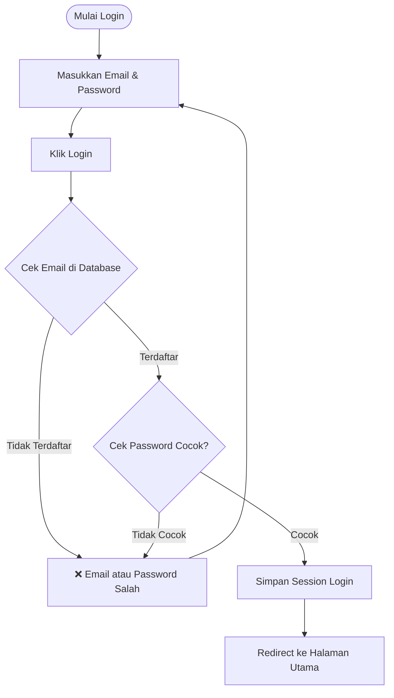
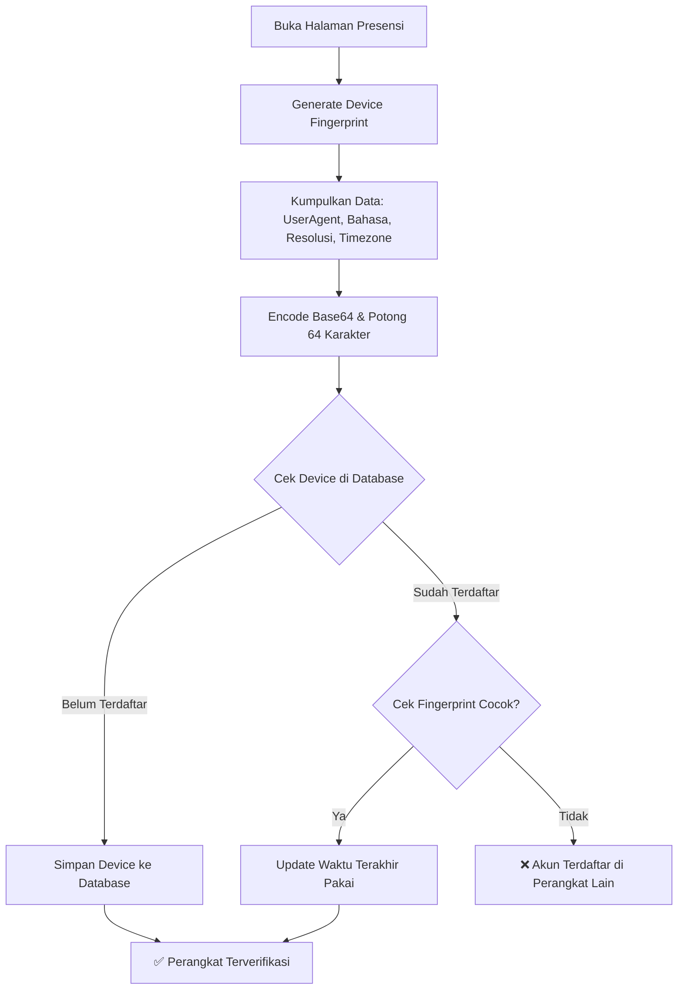
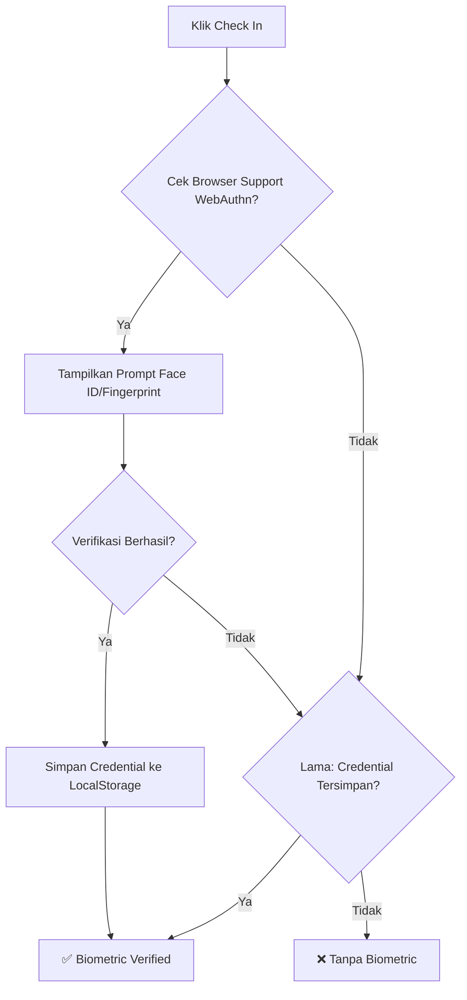
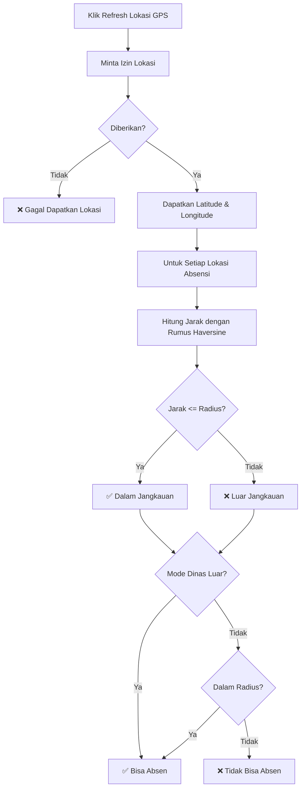
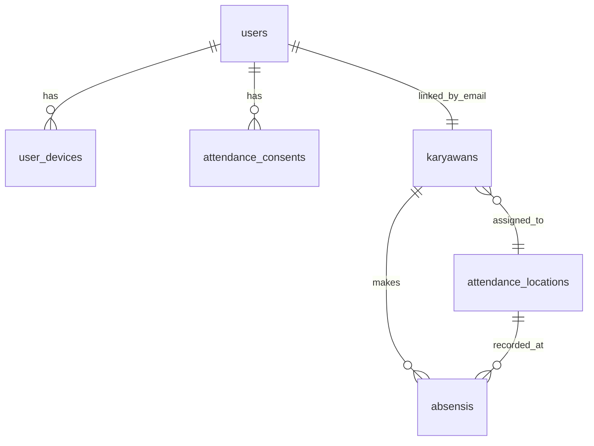

# Panduan Keamanan Aplikasi SmartHR

Dokumentasi lengkap tentang implementasi keamanan di aplikasi Sistem Informasi Kepegawaian (SmartHR).

---

## Daftar Isi
1. [Autentikasi dan Login](#1-autentikasi-dan-login)
2. [Device Binding (Satu Akun Satu Perangkat)](#2-device-binding-satu-akun-satu-perangkat)
3. [Verifikasi Biometrik (Face ID / Fingerprint)](#3-verifikasi-biometrik-face-id--fingerprint)
4. [Geofencing (Pembatasan Lokasi Absensi)](#4-geofencing-pembatasan-lokasi-absensi)
5. [Attendance Consent (Persetujuan)](#5-attendance-consent-persetujuan)
6. [Audit Trail dan Data Integrity](#6-audit-trail-dan-data-integrity)
7. [Ringkasan Fitur Keamanan](#7-ringkasan-fitur-keamanan)

---

## 1. Autentikasi dan Login

### Alur Login


### Detail Keamanan Password
- **Hashing**: Password tidak pernah disimpan dalam bentuk plain text, melainkan di-hash menggunakan Laravel Hash yang mendukung **Bcrypt** atau **Argon2**.
- **Casting Password**: Implementasi di [User.php](file:///c:\xampp\htdocs\Aplikasi HR Karyawan\app\Models\User.php#L46) dengan `'password' => 'hashed'`.
- **Verifikasi**: Menggunakan `Hash::check()` di [LoginController.php](file:///c:\xampp\htdocs\Aplikasi HR Karyawan\app\Http\Controllers\LoginController.php#L71) untuk membandingkan password input dengan hash di database.

### Alur Login Berdasarkan Role
- **Admin**: Diarahkan ke halaman dashboard utama (`/`).
- **Manajer/Karyawan**: Diarahkan ke portal karyawan (`/portal/home`).
- Implementasi di [LoginController.php](file:///c:\xampp\htdocs\Aplikasi HR Karyawan\app\Http\Controllers\LoginController.php#L88-L96).

---

## 2. Device Binding (Satu Akun Satu Perangkat)

### Alur Kerja


### Komponen Fingerprint
Fingerprint di-generate dari karakteristik perangkat berikut:
1. **User Agent**: Informasi browser dan sistem operasi
2. **Bahasa**: Bahasa yang digunakan di browser
3. **Resolusi Layar**: Lebar x tinggi dan color depth
4. **Zona Waktu**: Timezone browser

### Implementasi Frontend
Di [portal.js](file:///c:\xampp\htdocs\Aplikasi HR Karyawan\public\js\portal.js#L6-L21):
```javascript
function getDeviceFingerprint() {
    let fp = localStorage.getItem(STORAGE_DEVICE);
    if (!fp) {
        const raw = [
            navigator.userAgent,
            navigator.language,
            screen.width,
            screen.height,
            screen.colorDepth,
            Intl.DateTimeFormat().resolvedOptions().timeZone,
        ].join('|');
        fp = btoa(raw).replace(/[^a-zA-Z0-9]/g, '').slice(0, 64);
        localStorage.setItem(STORAGE_DEVICE, fp);
    }
    return fp;
}
```

### Implementasi Backend
Di [DeviceBindingService.php](file:///c:\xampp\htdocs\Aplikasi HR Karyawan\app\Services\DeviceBindingService.php#L11-L42):
- Cek apakah user sudah memiliki perangkat terdaftar
- Jika belum, daftarkan perangkat baru
- Jika sudah, verifikasi fingerprint cocok
- Jika tidak cocok, kembalikan pesan error

### Tabel UserDevice
Menyimpan informasi perangkat:
- `user_id`: Relasi ke user
- `device_fingerprint`: Fingerprint unik perangkat
- `device_label`: Label perangkat (contoh: Chrome/Windows/1920x1080)
- `user_agent`: Informasi browser lengkap
- `platform`: Platform sistem operasi
- `registered_at`: Waktu pendaftaran perangkat
- `last_used_at`: Waktu terakhir perangkat digunakan

---

## 3. Verifikasi Biometrik (Face ID / Fingerprint)

### Alur Kerja


### Teknologi WebAuthn
Menggunakan **Web Authentication (WebAuthn) API** - standar W3C untuk autentikasi tanpa password.

#### Parameter Konfigurasi:
- **Protokol**: WebAuthn
- **Autentikator**: Platform (Touch ID, Face ID, Windows Hello)
- **User Verification**: Diwajibkan (`userVerification: 'required'`)
- **Algoritme**: ES256 (`alg: -7`)

### Implementasi Frontend
Di [portal.js](file:///c:\xampp\htdocs\Aplikasi HR Karyawan\public\js\portal.js#L172-L212):
- Generate random 32-byte challenge untuk keamanan
- Meminta verifikasi biometrik dari pengguna
- Menyimpan credential ID di localStorage jika berhasil
- Fallback ke stored credential jika WebAuthn tidak didukung

---

## 4. Geofencing (Pembatasan Lokasi Absensi)

### Alur Kerja


### Rumus Haversine
Menghitung jarak antara dua titik koordinat dalam meter:
```
R = radius bumi (6371000 meter)
dLat = (lat2 - lat1) × π/180
dLon = (lon2 - lon1) × π/180
a = sin²(dLat/2) + cos(lat1) × cos(lat2) × sin²(dLon/2)
c = 2 × atan2(√a, √(1-a))
jarak = R × c
```

### Implementasi Frontend
Di [portal.js](file:///c:\xampp\htdocs\Aplikasi HR Karyawan\public\js\portal.js#L54-L170):
- Menggunakan `navigator.geolocation` dengan `enableHighAccuracy: true`
- Menghitung jarak dengan rumus Haversine
- Memantau perubahan lokasi secara real-time

### Implementasi Backend
Di [PresensiController.php](file:///c:\xampp\htdocs\Aplikasi HR Karyawan\app\Http\Controllers\PresensiController.php#L126-L198):
- **Double-check**: Verifikasi lokasi dilakukan kembali di backend (tidak hanya frontend)
- **Prioritas Lokasi**:
  1. Lokasi yang di-assign khusus ke karyawan
  2. Semua lokasi aktif jika tidak ada yang di-assign
- **Mode Dinas Luar**: Pengecualian untuk karyawan yang sedang dinas luar

---

## 5. Attendance Consent (Persetujuan)

### Alur Kerja
Sebelum bisa melakukan absensi, karyawan harus menyetujui:
1. **Perjanjian Absensi**: Surat perjanjian tentang ketentuan dan kebijakan absensi
2. **Task List Flowchart**: Persetujuan memahami alur kerja presensi

### Implementasi
Di [PresensiController.php](file:///c:\xampp\htdocs\Aplikasi HR Karyawan\app\Http\Controllers\PresensiController.php#L262-L278):
- Mengecek di tabel `attendance_consents` apakah kedua jenis consent sudah disetujui
- Jika belum, pengguna diarahkan ke halaman consent
- Consent menyimpan: user_id, jenis consent, status disetujui, waktu persetujuan, dan IP address

---

## 6. Audit Trail dan Data Integrity

### Metadata Absensi
Semua data absensi disimpan dengan metadata lengkap untuk keperluan audit:

| Metadata | Keterangan |
|----------|------------|
| `tanggal_absensi` | Tanggal absensi |
| `time` | Waktu absensi |
| `latitude` & `longitude` | Koordinat lokasi |
| `accuracy` | Akurasi GPS dalam meter |
| `jarak_meter` | Jarak dari lokasi kantor |
| `device_fingerprint` | Fingerprint perangkat |
| `biometric_verified` | Status verifikasi biometrik |
| `lokasi_dinas` | Apakah dalam mode dinas luar |
| `user_agent` | Informasi browser |
| `created_at` | Waktu penyimpanan data |

### Implementasi
Di [PresensiController.php](file:///c:\xampp\htdocs\Aplikasi HR Karyawan\app\Http\Controllers\PresensiController.php#L232-L250), semua metadata disimpan ke tabel `absensis`.

---

## 7. Ringkasan Fitur Keamanan

### Tabel Ringkasan
| Fitur | Teknologi | File Implementasi |
|-------|-----------|-------------------|
| Autentikasi | Laravel Auth, Session | [LoginController.php](file:///c:\xampp\htdocs\Aplikasi HR Karyawan\app\Http\Controllers\LoginController.php) |
| Password Hashing | Bcrypt/Argon2 | [User.php](file:///c:\xampp\htdocs\Aplikasi HR Karyawan\app\Models\User.php) |
| Device Binding | Fingerprint (UserAgent, Resolusi, Timezone) | [DeviceBindingService.php](file:///c:\xampp\htdocs\Aplikasi HR Karyawan\app\Services\DeviceBindingService.php), [portal.js](file:///c:\xampp\htdocs\Aplikasi HR Karyawan\public\js\portal.js) |
| Biometrik | WebAuthn API | [portal.js](file:///c:\xampp\htdocs\Aplikasi HR Karyawan\public\js\portal.js) |
| Geofencing | GPS, Rumus Haversine | [PresensiController.php](file:///c:\xampp\htdocs\Aplikasi HR Karyawan\app\Http\Controllers\PresensiController.php), [GeolocationService.php](file:///c:\xampp\htdocs\Aplikasi HR Karyawan\app\Support\GeolocationService.php) |
| Attendance Consent | Tabel attendance_consents | [PresensiController.php](file:///c:\xampp\htdocs\Aplikasi HR Karyawan\app\Http\Controllers\PresensiController.php) |
| Audit Trail | Metadata lengkap di tabel absensis | [PresensiController.php](file:///c:\xampp\htdocs\Aplikasi HR Karyawan\app\Http\Controllers\PresensiController.php) |

### Skema Database


---

## Kesimpulan
Semua fitur keamanan di SmartHR bekerja bersama untuk memastikan bahwa:
- Hanya pengguna yang berwenang yang bisa login
- Satu akun hanya bisa digunakan di satu perangkat
- Absensi hanya bisa dilakukan di lokasi yang benar
- Verifikasi biometrik menambah lapisan keamanan tambahan
- Semua aktivitas tercatat dengan baik untuk audit
