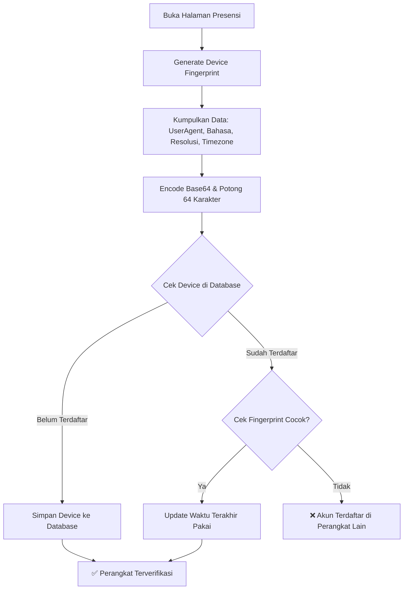
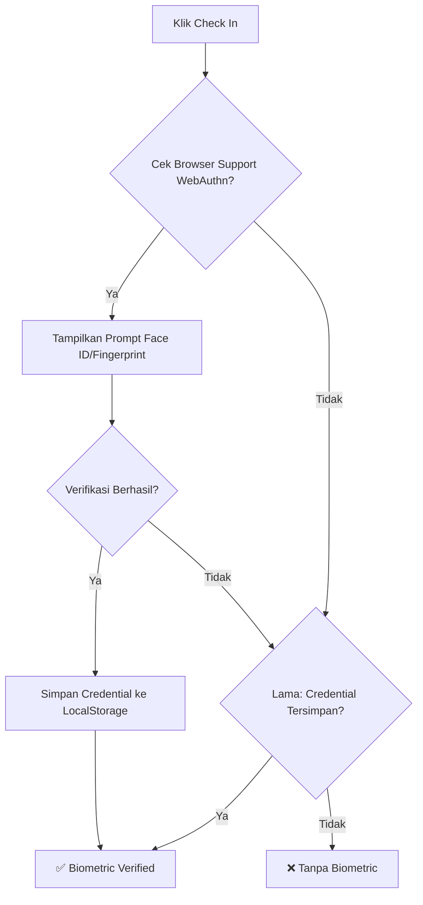
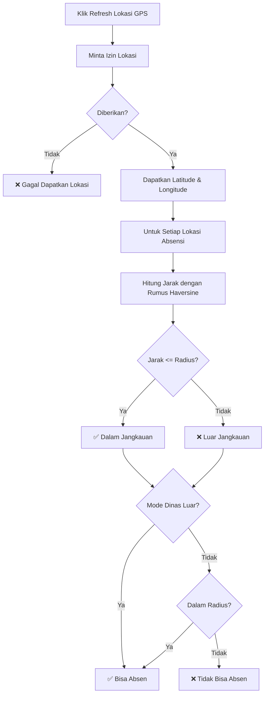
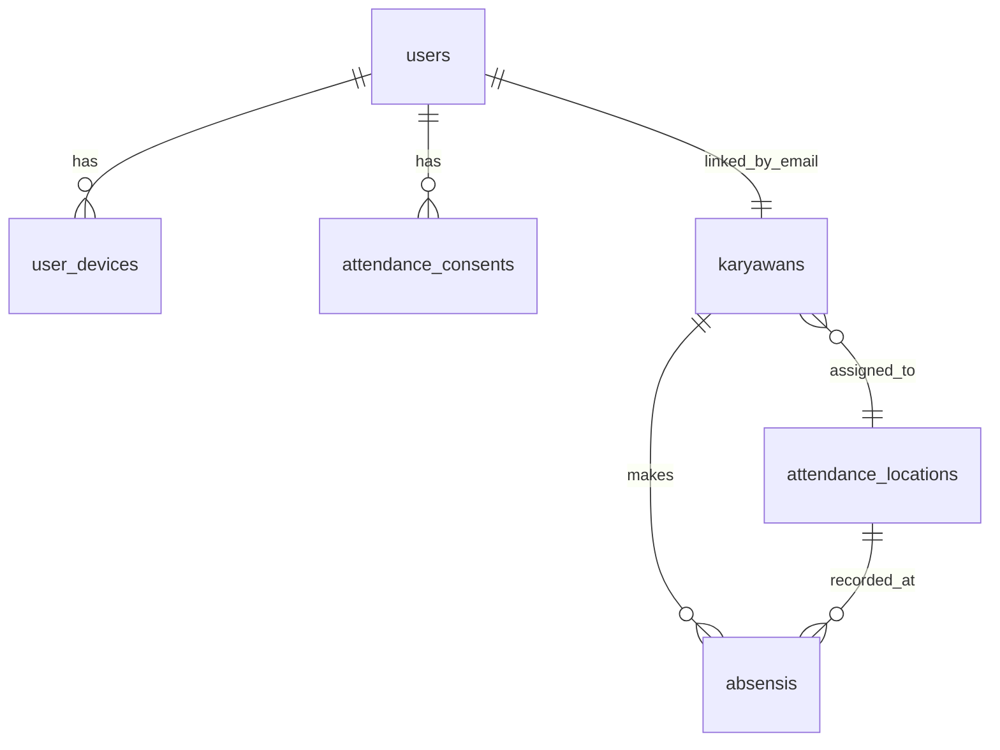

# Panduan Keamanan Aplikasi SmartHR

Dokumentasi ringkas dan mudah dibaca tentang implementasi keamanan di Sistem Informasi Kepegawaian (SmartHR).

---

## Daftar Isi
1. [Autentikasi dan Login](#1-autentikasi-dan-login)
2. [Device Binding (Satu Akun Satu Perangkat)](#2-device-binding-satu-akun-satu-perangkat)
3. [Verifikasi Biometrik (Face ID / Fingerprint)](#3-verifikasi-biometrik-face-id--fingerprint)
4. [Geofencing (Pembatasan Lokasi Absensi)](#4-geofencing-pembatasan-lokasi-absensi)
5. [Attendance Consent (Persetujuan)](#5-attendance-consent-persetujuan)
6. [Audit Trail dan Data Integrity](#6-audit-trail-dan-data-integrity)
7. [Ringkasan Fitur Keamanan](#7-ringkasan-fitur-keamanan)

---

## 1. Autentikasi dan Login

### Alur Login


### Detail Keamanan Password
- **Hashing**: Password dienkripsi dengan Bcrypt atau Argon2, tidak pernah disimpan dalam bentuk teks biasa.
- **Verifikasi**: Sistem membandingkan password input dengan hash yang ada di database.

### Alur Login Berdasarkan Role
- **Admin**: Masuk ke dashboard utama
- **Manajer/Karyawan**: Masuk ke portal karyawan

---

## 2. Device Binding (Satu Akun Satu Perangkat)

### Alur Kerja


### Komponen Fingerprint
Fingerprint dibuat dari:
1. User Agent (browser & OS)
2. Bahasa browser
3. Resolusi layar
4. Timezone

### Data yang Disimpan
- User ID
- Fingerprint unik
- Label perangkat
- User Agent
- Platform OS
- Waktu daftar & terakhir dipakai

---

## 3. Verifikasi Biometrik (Face ID / Fingerprint)

### Alur Kerja


### Teknologi WebAuthn
- Standar W3C untuk autentikasi tanpa password
- Mendukung Touch ID, Face ID, Windows Hello
- Verifikasi pengguna diwajibkan
- Algoritme ES256

---

## 4. Geofencing (Pembatasan Lokasi Absensi)

### Alur Kerja


### Rumus Haversine
Menghitung jarak antara 2 titik koordinat:
```
R = radius bumi (6371000 meter)
dLat = (lat2 - lat1) × π/180
dLon = (lon2 - lon1) × π/180
a = sin²(dLat/2) + cos(lat1) × cos(lat2) × sin²(dLon/2)
c = 2 × atan2(√a, √(1-a))
jarak = R × c
```

### Cara Kerja
- Lokasi diambil dengan GPS akurasi tinggi
- Jarak dihitung dengan rumus Haversine
- Verifikasi dilakukan 2x (frontend & backend)
- Ada mode dinas luar untuk pengecualian

---

## 5. Attendance Consent (Persetujuan)

Sebelum absensi, karyawan harus menyetujui:
1. Perjanjian Absensi
2. Task List Flowchart (memahami alur presensi)

### Data yang Disimpan
- User ID
- Jenis consent
- Status disetujui
- Waktu persetujuan
- Alamat IP

---

## 6. Audit Trail dan Data Integrity

### Metadata Absensi
Semua data dicatat untuk audit:

| Metadata | Keterangan |
|----------|------------|
| Tanggal & waktu | Waktu absensi |
| Koordinat | Latitude & longitude |
| Akurasi | Akurasi GPS |
| Jarak | Jarak dari lokasi kantor |
| Fingerprint | ID perangkat |
| Biometric | Status verifikasi wajah/sidik jari |
| Dinas | Apakah mode dinas luar aktif |
| Browser | User Agent |
| Timestamp | Waktu penyimpanan |

---

## 7. Ringkasan Fitur Keamanan

### Tabel Ringkasan
| Fitur | Teknologi |
|-------|-----------|
| Autentikasi | Laravel Auth + Session |
| Password Hashing | Bcrypt / Argon2 |
| Device Binding | Fingerprint perangkat |
| Biometrik | WebAuthn API |
| Geofencing | GPS + Rumus Haversine |
| Attendance Consent | Persetujuan pengguna |
| Audit Trail | Metadata lengkap |

### Skema Database


---

## Kesimpulan
Sistem keamanan SmartHR bekerja secara terintegrasi untuk memastikan:
- Hanya pengguna berwenang yang bisa login
- Satu akun hanya dipakai di satu perangkat
- Absensi hanya bisa di lokasi yang ditentukan
- Verifikasi biometrik menambah keamanan
- Semua aktivitas tercatat dengan baik untuk audit

