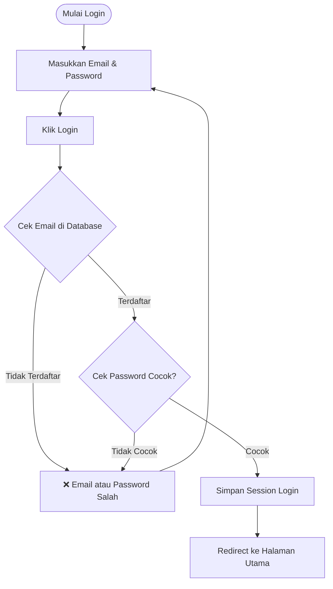
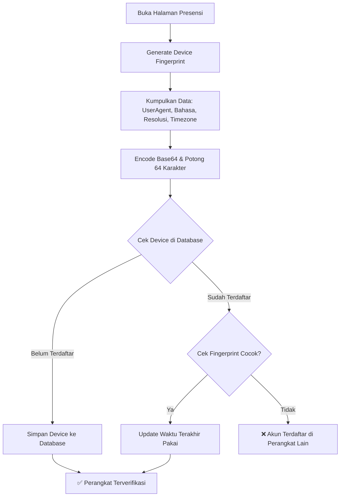
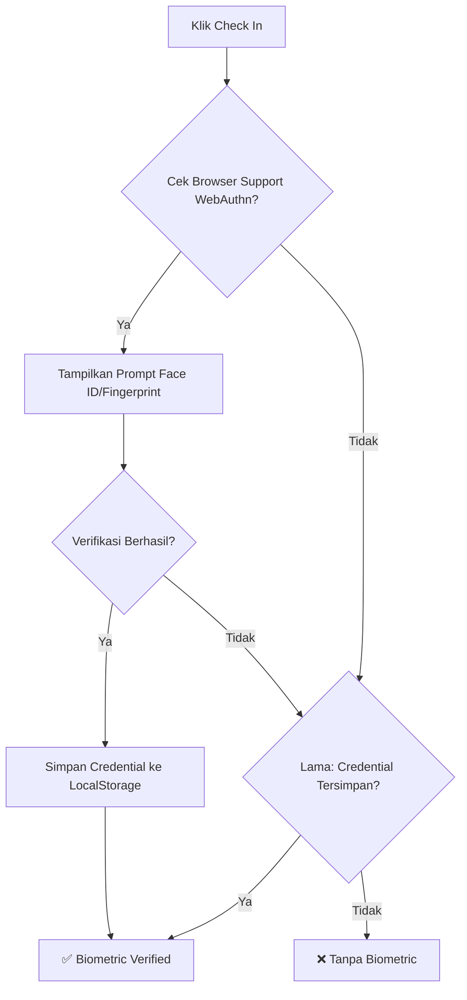
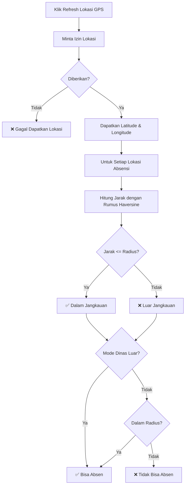
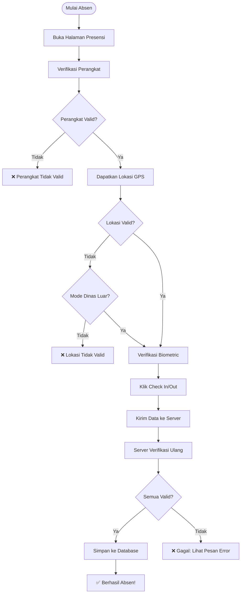
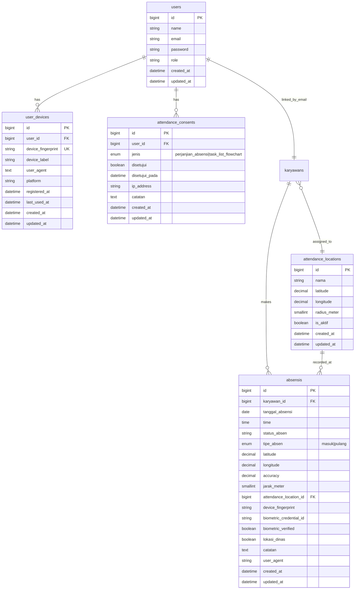

# Diagram Alur Keamanan dan Presensi SmartHR (Versi Flowchart)

---

## 1. Alur Autentikasi dan Keamanan



### Detail Keamanan Password:
- **Hashing**: Menggunakan Laravel Hash (Bcrypt/Argon2)
- **Enkripsi**: Password tidak pernah disimpan dalam bentuk plain text
- **Verifikasi**: Hash::check() membandingkan password input dengan hash di database

---

## 2. Alur Device Binding dan Fingerprint



### Komponen Fingerprint:
- **User Agent**: Informasi browser dan OS
- **Bahasa**: Bahasa browser
- **Resolusi Layar**: Lebar x tinggi dan color depth
- **Zona Waktu**: Timezone browser

---

## 3. Alur Verifikasi Biometrik (Face ID / Fingerprint)



### Detail WebAuthn:
- **Protokol**: Web Authentication (WebAuthn) API
- **Autentikator**: Platform (Touch ID, Face ID, Windows Hello)
- **User Verification**: Diwajibkan (userVerification: 'required')
- **Algoritme**: ES256 (alg: -7)

---

## 4. Alur Pemetaan Lokasi Absensi (Geofencing)



### Rumus Haversine (Jarak antara 2 titik):
```
R = radius bumi (6371000 meter)
dLat = (lat2 - lat1) × π/180
dLon = (lon2 - lon1) × π/180
a = sin²(dLat/2) + cos(lat1) × cos(lat2) × sin²(dLon/2)
c = 2 × atan2(√a, √(1-a))
jarak = R × c
```

---

## 5. Alur Absensi Lengkap (End-to-End)



---

## 6. Skema Database (Tabel Terkait)



---

## Ringkasan Fitur Keamanan:

1. **Autentikasi**:
   - Login email/password dengan Laravel Auth
   - Password di-hash dengan Bcrypt/Argon2
   - Session-based authentication

2. **Device Binding**:
   - Satu akun hanya bisa dipakai di satu perangkat
   - Fingerprint di-generate dari karakteristik browser/device
   - Penyimpanan last_used_at untuk audit

3. **Biometric Verification**:
   - WebAuthn API untuk Face ID / Fingerprint / Windows Hello
   - Fallback ke stored credential jika WebAuthn tidak didukung
   - User verification diwajibkan

4. **Geofencing**:
   - Verifikasi lokasi dengan GPS (enableHighAccuracy)
   - Rumus Haversine untuk perhitungan jarak
   - Backend double-check untuk keamanan
   - Mode dinas luar untuk pengecualian lokasi

5. **Data Integrity**:
   - Semua metadata absensi disimpan (lat, lng, accuracy, device_fingerprint, biometric, user_agent)
   - Attendance consent sebelum absensi diizinkan
