# Diagram Sequence — Aplikasi HR Karyawan

Dokumen ini berisi diagram sequence per modul/alur bisnis. Dapat dirender di GitHub, GitLab, VS Code (Mermaid), atau [mermaid.live](https://mermaid.live).

## Daftar Isi

1. [Login & Redirect](#1-login--redirect)
2. [Persetujuan Absensi (Consent)](#2-persetujuan-absensi-consent)
3. [Presensi Portal (Check-in/out)](#3-presensi-portal-check-inout)
4. [Sinkronisasi Presensi Offline](#4-sinkronisasi-presensi-offline)
5. [Pengajuan Cuti (Portal)](#5-pengajuan-cuti-portal)
6. [Persetujuan Cuti](#6-persetujuan-cuti)
7. [Lembur (Overtime)](#7-lembur-overtime)
8. [Reimbursement](#8-reimbursement)
9. [Payroll / Gaji (Admin)](#9-payroll--gaji-admin)
10. [Lihat Gaji (Portal Karyawan)](#10-lihat-gaji-portal-karyawan)
11. [Absensi Manual (Admin)](#11-absensi-manual-admin)
12. [Tambah Karyawan & Akun User](#12-tambah-karyawan--akun-user)
13. [Reset Perangkat Karyawan](#13-reset-perangkat-karyawan)
14. [Setup Titik Lokasi Absensi](#14-setup-titik-lokasi-absensi)

---

## Ringkasan Aktor

| Aktor | Peran |
|-------|-------|
| **Karyawan** | Pegawai biasa (`role=karyawan`) |
| **Atasan** | Supervisor (`role=atasan` / `manajer`) |
| **Admin HR** | Pengelola HR (`role=admin_hr`) |
| **Browser** | GPS, WebAuthn, localStorage |
| **Portal.js** | Script frontend portal |
| **Controller** | Laravel Controller |
| **Service** | Business logic (DeviceBinding, LeaveBalance, dll.) |
| **Database** | MySQL via Eloquent |

---

## 1. Login & Redirect

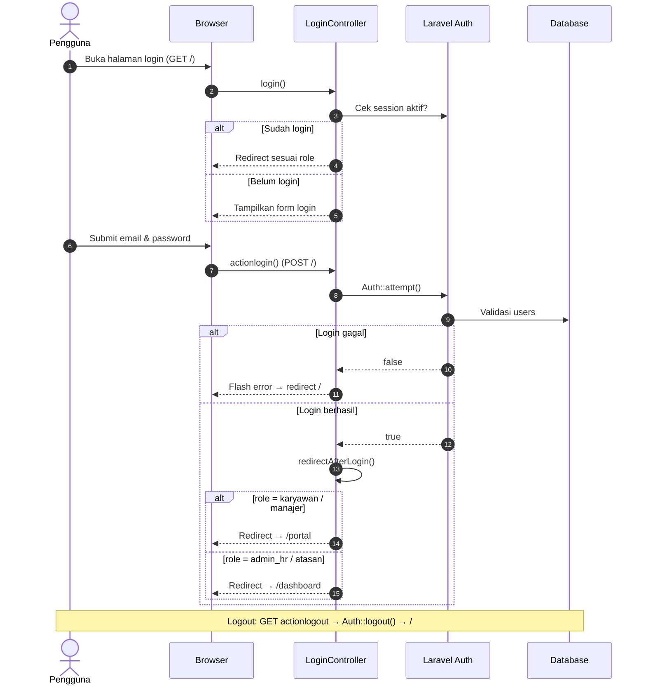

---

## 2. Persetujuan Absensi (Consent)

> Prasyarat sebelum karyawan bisa check-in presensi.

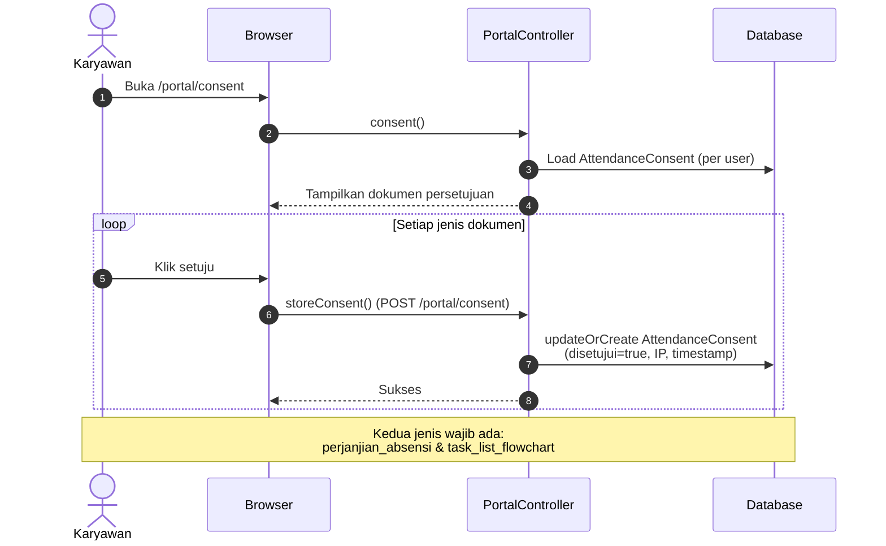

---

## 3. Presensi Portal (Check-in/out)

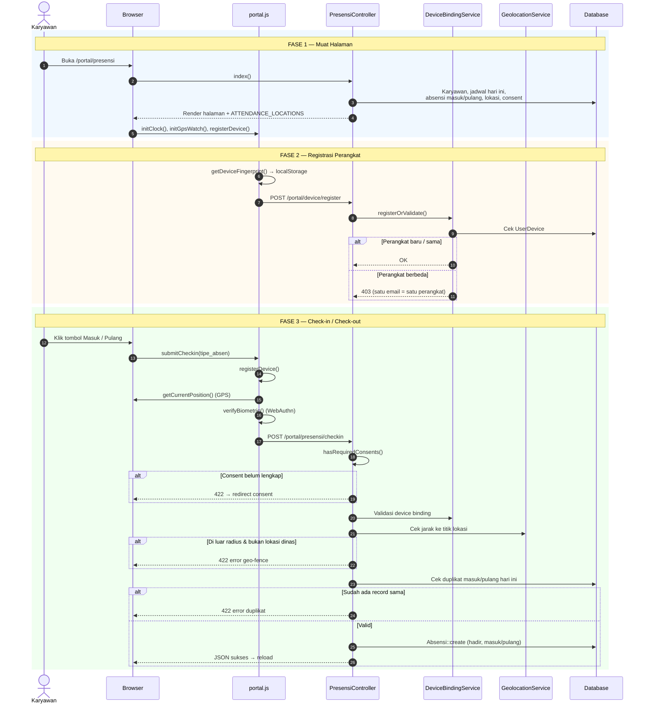

---

## 4. Sinkronisasi Presensi Offline

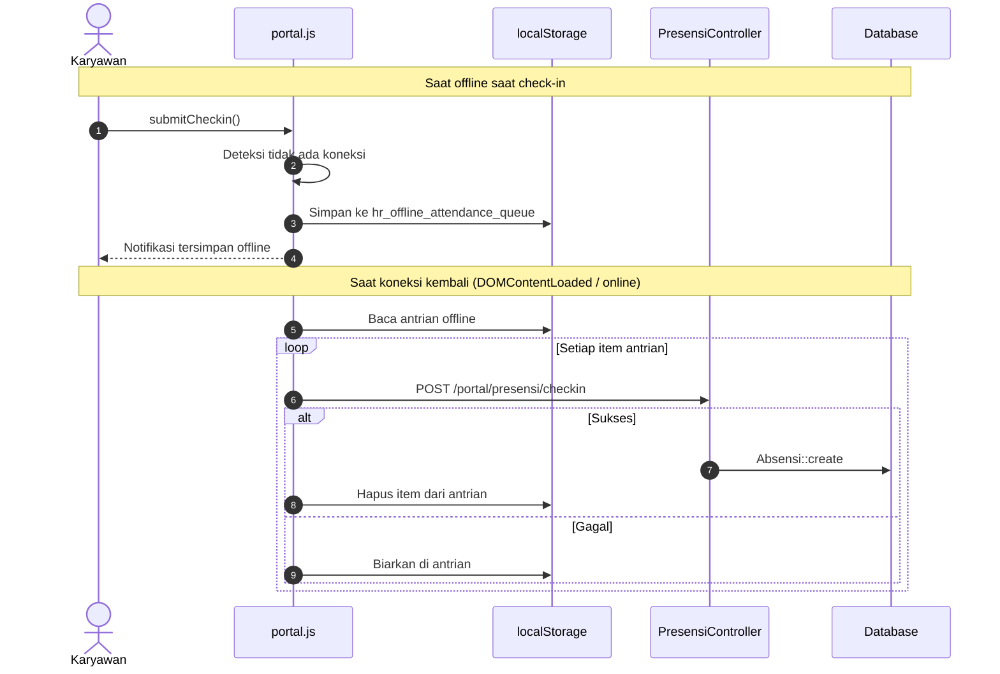

---

## 5. Pengajuan Cuti (Portal)

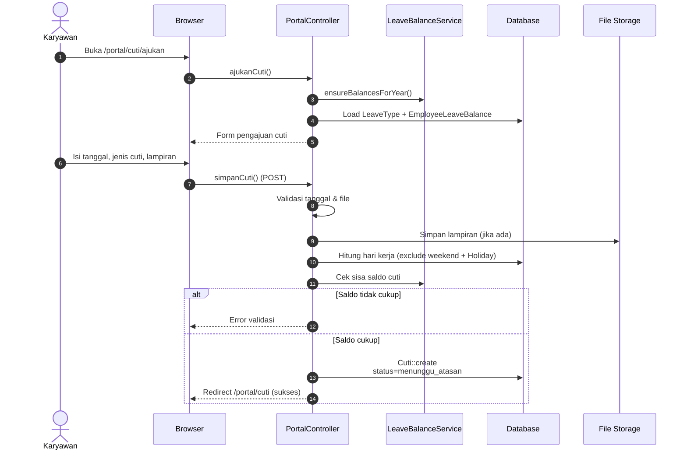

---

## 6. Persetujuan Cuti

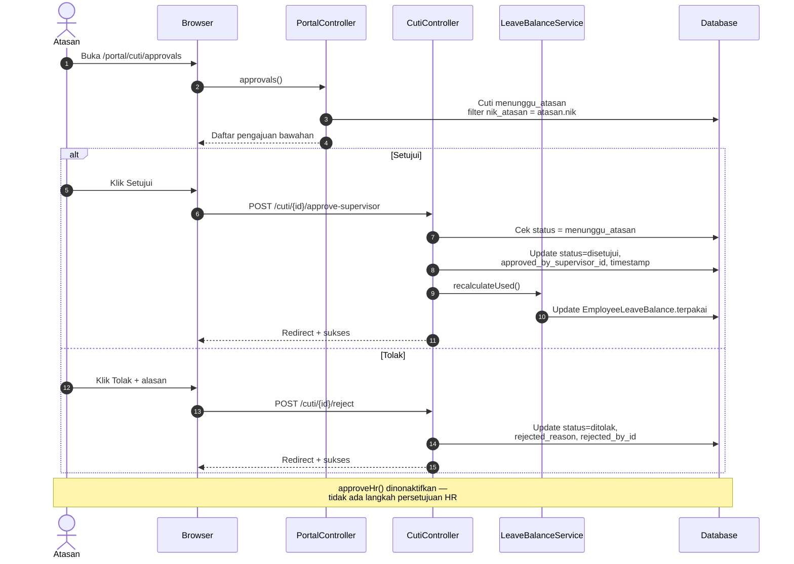

---

## 7. Lembur (Overtime)

### 7a. Pengajuan Lembur (Portal)

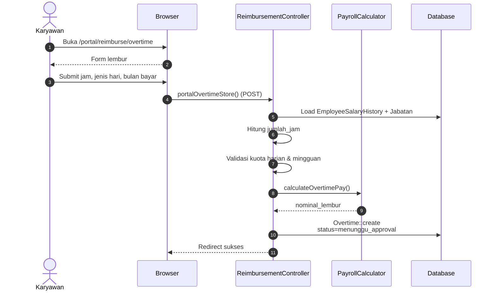

### 7b. Persetujuan Lembur

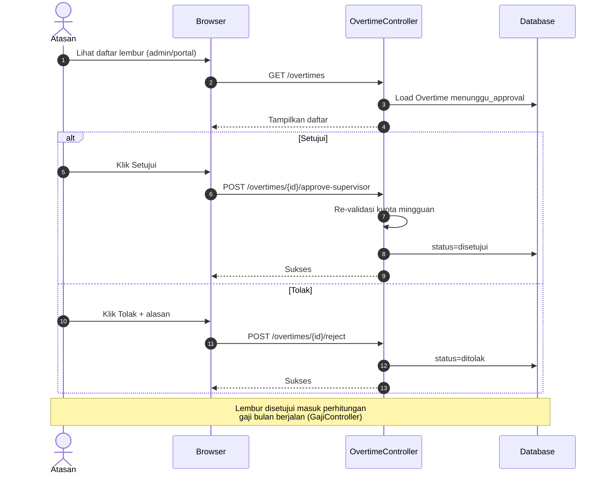

---

## 8. Reimbursement

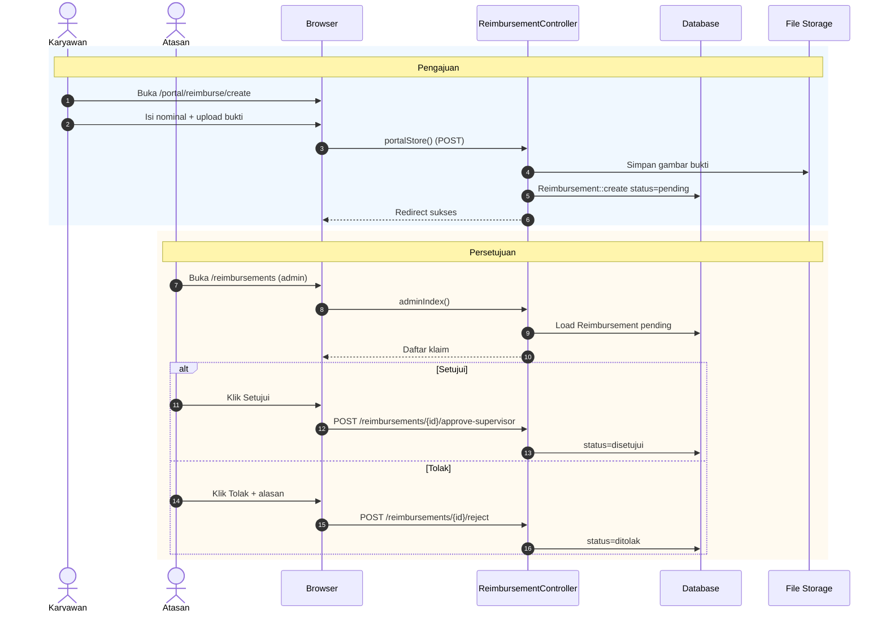

---

## 9. Payroll / Gaji (Admin)

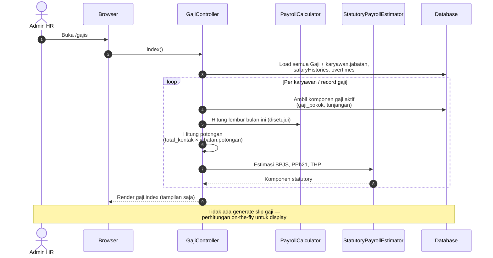

---

## 10. Lihat Gaji (Portal Karyawan)

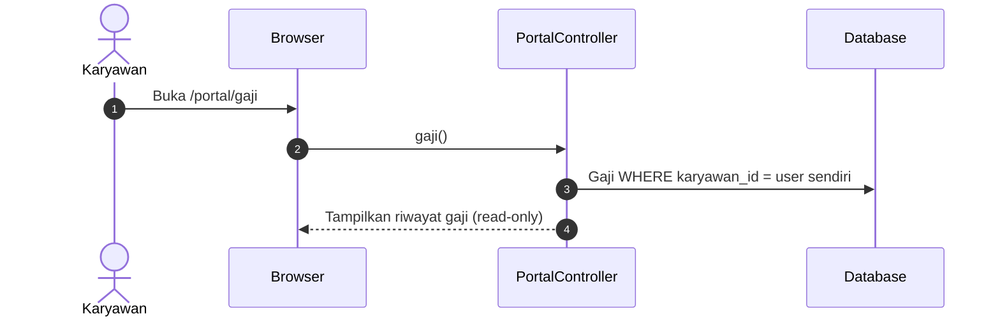

---

## 11. Absensi Manual (Admin)

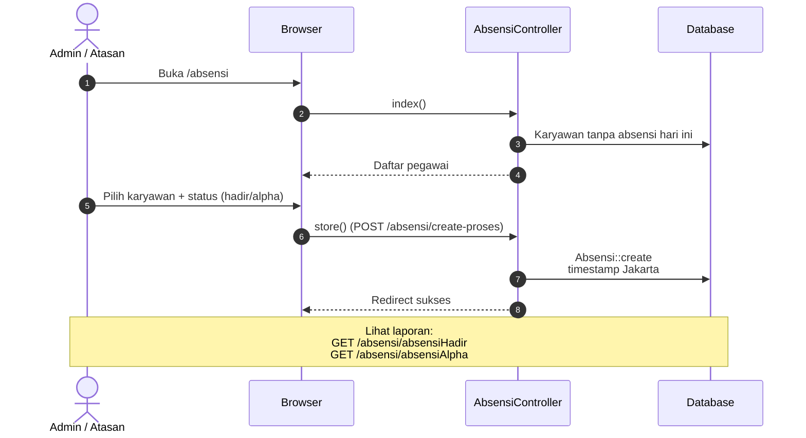

---

## 12. Tambah Karyawan & Akun User

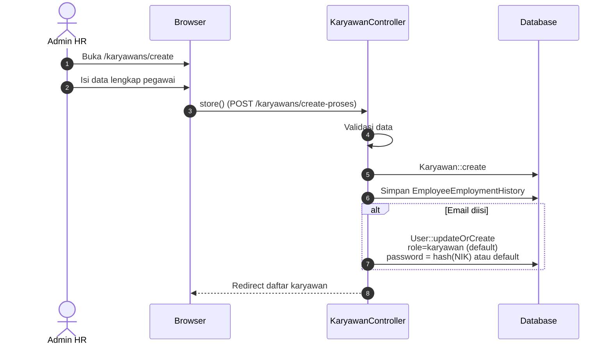

---

## 13. Reset Perangkat Karyawan

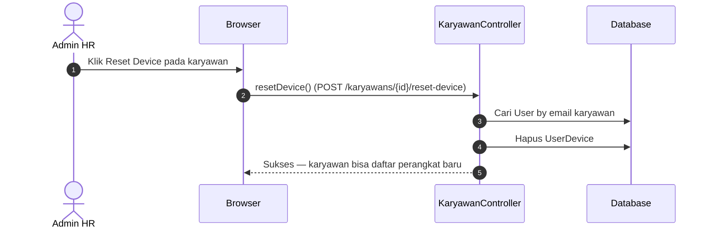

---

## 14. Setup Titik Lokasi Absensi

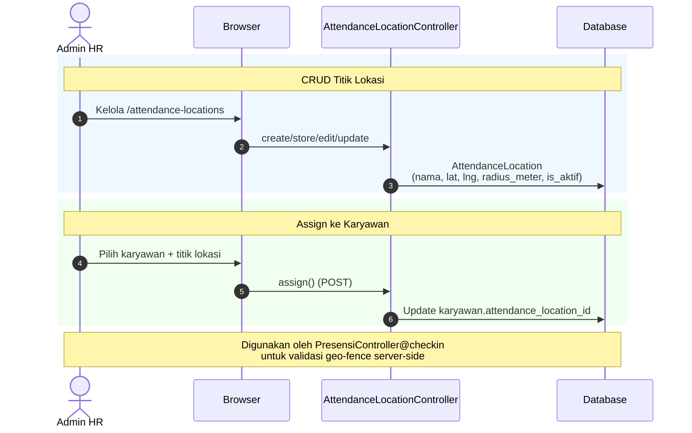

---

## Peta Modul & Alur

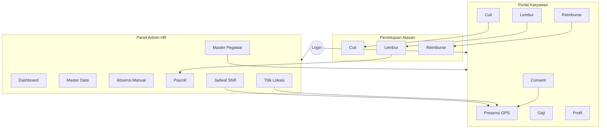

---

*Terakhir diperbarui berdasarkan struktur kode di `routes/web.php` dan controller terkait.*
