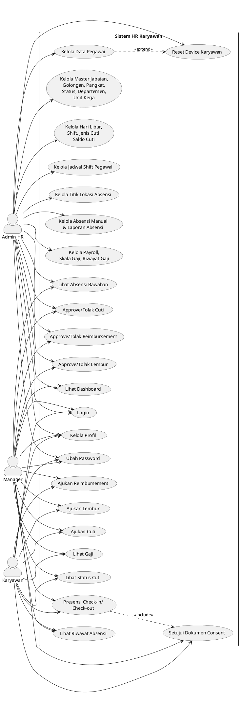

# Use Case Diagram — Aplikasi HR Karyawan

Dokumen ini merangkum use case utama sistem berdasarkan fitur yang tersedia pada `routes/web.php`, `PortalController`, dan menu aplikasi.

## Aktor

- `Admin HR`: mengelola data master, pegawai, absensi admin, payroll, dan approval tingkat admin.
- `Manager`: melihat data tim dan melakukan approval pengajuan bawahan.
- `Karyawan`: menggunakan portal untuk presensi, cuti, klaim, lembur, profil, dan melihat gaji.

## Diagram Use Case

## Ringkasan Use Case per Aktor

### Admin HR

- Login ke sistem
- Lihat dashboard
- Kelola profil dan ubah password
- Lihat absensi bawahan
- Approve/tolak cuti
- Approve/tolak reimbursement
- Approve/tolak lembur
- Kelola data pegawai
- Reset device karyawan
- Kelola master data kepegawaian
- Kelola hari libur, shift, jenis cuti, dan saldo cuti
- Kelola jadwal shift pegawai
- Kelola titik lokasi absensi
- Kelola absensi manual dan laporan absensi
- Kelola payroll, skala gaji, dan riwayat gaji

### Manager

- Login ke sistem
- Lihat dashboard portal
- Kelola profil dan ubah password
- Setujui dokumen consent
- Melakukan presensi check-in/check-out
- Lihat riwayat absensi sendiri
- Lihat absensi bawahan
- Ajukan cuti dan lihat status cuti
- Approve/tolak cuti bawahan
- Ajukan reimbursement
- Approve/tolak reimbursement bawahan
- Ajukan lembur
- Approve/tolak lembur bawahan
- Lihat gaji

### Karyawan

- Login ke sistem
- Kelola profil dan ubah password
- Setujui dokumen consent
- Melakukan presensi check-in/check-out
- Lihat riwayat absensi sendiri
- Ajukan cuti dan lihat status cuti
- Ajukan reimbursement
- Ajukan lembur
- Lihat gaji

## Catatan

- `Manager` pada implementasi aplikasi muncul sebagai role `manajer` dan juga mempunyai capability approval seperti `atasan`.
- `Admin HR` di proyek ini direpresentasikan terutama oleh role `admin_hr`.
- Use case di atas disusun dari fitur yang benar-benar terlihat pada route dan controller, bukan asumsi umum sistem HR.

## Susunan Siap Digambar di Draw.io

Bagian ini dibuat agar Anda bisa menggambar ulang dengan layout yang rapi dan mudah dibaca.

### 1. Boundary Sistem

- Buat satu kotak besar bernama `Sistem HR Karyawan`.
- Jangan pecah menjadi banyak kotak kecil per modul.
- Semua use case ditempatkan di dalam satu boundary ini.

### 2. Posisi Aktor

- Letakkan `Admin HR` di sisi kiri atas.
- Letakkan `Manager` di sisi kiri tengah.
- Letakkan `Karyawan` di sisi kiri bawah.
- Setiap aktor cukup digambar satu kali.

### 3. Susunan Use Case di Dalam Sistem

Susun oval dari atas ke bawah dalam 4 kelompok berikut.

#### A. Use Case Umum

- `Login`
- `Kelola Profil`
- `Ubah Password`

#### B. Use Case Portal Karyawan

- `Setujui Dokumen Consent`
- `Presensi Check-in/Check-out`
- `Lihat Riwayat Absensi`
- `Ajukan Cuti`
- `Lihat Status Cuti`
- `Ajukan Reimbursement`
- `Ajukan Lembur`
- `Lihat Gaji`

#### C. Use Case Approval Manager/Admin

- `Lihat Dashboard`
- `Lihat Absensi Bawahan`
- `Approve/Tolak Cuti`
- `Approve/Tolak Reimbursement`
- `Approve/Tolak Lembur`

#### D. Use Case Administrasi HR

- `Kelola Data Pegawai`
- `Reset Device Karyawan`
- `Kelola Master Jabatan, Golongan, Pangkat, Status, Departemen, Unit Kerja`
- `Kelola Hari Libur, Shift, Jenis Cuti, Saldo Cuti`
- `Kelola Jadwal Shift Pegawai`
- `Kelola Titik Lokasi Absensi`
- `Kelola Absensi Manual & Laporan Absensi`
- `Kelola Payroll, Skala Gaji, Riwayat Gaji`

### 4. Hubungan Aktor ke Use Case

#### Admin HR terhubung ke:

- `Login`
- `Lihat Dashboard`
- `Kelola Profil`
- `Ubah Password`
- `Lihat Absensi Bawahan`
- `Approve/Tolak Cuti`
- `Approve/Tolak Reimbursement`
- `Approve/Tolak Lembur`
- `Kelola Data Pegawai`
- `Reset Device Karyawan`
- `Kelola Master Jabatan, Golongan, Pangkat, Status, Departemen, Unit Kerja`
- `Kelola Hari Libur, Shift, Jenis Cuti, Saldo Cuti`
- `Kelola Jadwal Shift Pegawai`
- `Kelola Titik Lokasi Absensi`
- `Kelola Absensi Manual & Laporan Absensi`
- `Kelola Payroll, Skala Gaji, Riwayat Gaji`

#### Manager terhubung ke:

- `Login`
- `Lihat Dashboard`
- `Kelola Profil`
- `Ubah Password`
- `Setujui Dokumen Consent`
- `Presensi Check-in/Check-out`
- `Lihat Riwayat Absensi`
- `Lihat Absensi Bawahan`
- `Ajukan Cuti`
- `Lihat Status Cuti`
- `Approve/Tolak Cuti`
- `Ajukan Reimbursement`
- `Approve/Tolak Reimbursement`
- `Ajukan Lembur`
- `Approve/Tolak Lembur`
- `Lihat Gaji`

#### Karyawan terhubung ke:

- `Login`
- `Kelola Profil`
- `Ubah Password`
- `Setujui Dokumen Consent`
- `Presensi Check-in/Check-out`
- `Lihat Riwayat Absensi`
- `Ajukan Cuti`
- `Lihat Status Cuti`
- `Ajukan Reimbursement`
- `Ajukan Lembur`
- `Lihat Gaji`

### 5. Relasi Antar Use Case

- `Presensi Check-in/Check-out` `<<include>>` `Setujui Dokumen Consent`
- `Kelola Data Pegawai` `<<extend>>` `Reset Device Karyawan`

### 6. Tips Supaya Diagram Rapi

- Gunakan orientasi landscape.
- Kelompokkan oval berdasarkan fungsi, bukan berdasarkan aktor.
- Hindari garis yang saling silang terlalu banyak.
- Jika terlalu padat, lebarkan boundary sistem ke samping, bukan menambah aktor yang sama berulang kali.

## Versi Final Untuk Skripsi

Berikut susunan final yang lebih formal dan siap dipakai sebagai acuan gambar maupun penjelasan di bab perancangan sistem.

### Nama Diagram

`Use Case Diagram Sistem HR Karyawan`

### Deskripsi Singkat

Use case diagram ini menggambarkan interaksi antara tiga aktor utama, yaitu `Admin HR`, `Manager`, dan `Karyawan`, dengan fitur-fitur yang tersedia pada sistem HR Karyawan. `Karyawan` berfokus pada penggunaan portal untuk presensi, pengajuan cuti, pengajuan reimbursement, pengajuan lembur, pengelolaan profil, dan melihat informasi gaji. `Manager` memiliki seluruh fungsi portal yang dimiliki karyawan serta tambahan kewenangan untuk memantau absensi bawahan dan memberikan persetujuan atau penolakan terhadap pengajuan cuti, reimbursement, dan lembur bawahan. `Admin HR` berperan dalam pengelolaan data kepegawaian, data master, jadwal kerja, lokasi absensi, absensi manual, payroll, serta memiliki akses terhadap proses approval tertentu di tingkat administrasi.

### Pembagian Aktor dan Use Case

#### Admin HR

- Login ke sistem
- Lihat dashboard
- Kelola profil
- Ubah password
- Lihat absensi bawahan
- Approve/tolak cuti
- Approve/tolak reimbursement
- Approve/tolak lembur
- Kelola data pegawai
- Reset device karyawan
- Kelola master jabatan, golongan, pangkat, status pegawai, departemen, dan unit kerja
- Kelola hari libur, shift kerja, jenis cuti, dan saldo cuti
- Kelola jadwal shift pegawai
- Kelola titik lokasi absensi
- Kelola absensi manual dan laporan absensi
- Kelola payroll, skala gaji, dan riwayat gaji

#### Manager

- Login ke sistem
- Lihat dashboard
- Kelola profil
- Ubah password
- Setujui dokumen consent
- Presensi check-in/check-out
- Lihat riwayat absensi
- Lihat absensi bawahan
- Ajukan cuti
- Lihat status cuti
- Approve/tolak cuti bawahan
- Ajukan reimbursement
- Approve/tolak reimbursement bawahan
- Ajukan lembur
- Approve/tolak lembur bawahan
- Lihat gaji

#### Karyawan

- Login ke sistem
- Kelola profil
- Ubah password
- Setujui dokumen consent
- Presensi check-in/check-out
- Lihat riwayat absensi
- Ajukan cuti
- Lihat status cuti
- Ajukan reimbursement
- Ajukan lembur
- Lihat gaji

### Relasi Use Case

- Use case `Presensi Check-in/Check-out` memiliki relasi `<<include>>` dengan use case `Setujui Dokumen Consent`, karena persetujuan dokumen menjadi prasyarat sebelum pengguna dapat melakukan presensi.
- Use case `Kelola Data Pegawai` memiliki relasi `<<extend>>` dengan use case `Reset Device Karyawan`, karena reset device merupakan aksi tambahan yang dilakukan dalam konteks pengelolaan data pegawai.

### Catatan Penulisan Skripsi

- Gunakan istilah aktor yang konsisten: `Admin HR`, `Manager`, dan `Karyawan`.
- Jika ingin lebih formal, kata `approve/tolak` dapat diganti menjadi `menyetujui/menolak`.
- Pada gambar final skripsi, cukup tampilkan satu diagram utama yang ringkas. Penjelasan detail tiap fitur bisa diletakkan pada narasi di bawah gambar.
