# Use Case Diagram Mermaid — Aplikasi HR Karyawan

Dokumen ini memisahkan use case `per aktor` dan `per modul`, mengikuti gaya diagram Anda yang membagi fitur menjadi kelompok-kelompok kecil agar lebih lengkap.

## Ketentuan Bentuk dan Relasi

Bagian ini merangkum aturan bentuk diagram agar konsisten dengan notasi use case yang lebih formal.

### 1. Ketentuan Bentuk

- `Aktor` digambar dengan ikon manusia atau label aktor di luar boundary sistem.
- `Use case` digambar dengan bentuk oval.
- `Boundary sistem` digambar dengan kotak besar bernama `Sistem HR Karyawan`.
- `Modul` pada gaya diagram Anda boleh digambar sebagai kotak pengelompokan kecil, tetapi secara UML kotak itu diposisikan sebagai pengelompokan visual, bukan boundary sistem baru.

### 2. Ketentuan Garis

- `Association`:
  garis penuh dari aktor ke use case untuk menunjukkan aktor menggunakan fitur.
- `<<include>>`:
  garis putus-putus berpanah dari use case utama ke use case yang selalu dipanggil sebagai bagian proses.
- `<<extend>>`:
  garis putus-putus berpanah dari use case tambahan ke use case dasar yang dapat diperluas pada kondisi tertentu.

### 3. Catatan Penting

- Istilah yang benar adalah `<<include>>` dan `<<extend>>`, bukan `exclude`.
- Tidak semua hubungan induk-anak cocok memakai `<<include>>`. Jika sebuah fitur hanya pengelompokan menu seperti `Kelola Data Pegawai` yang berisi `Tambah`, `Ubah`, dan `Hapus`, pada skripsi sering lebih aman dijelaskan sebagai rincian scope modul, bukan dipaksa sebagai relasi UML formal.
- Karena `Mermaid` tidak menyediakan notasi use case UML seformal `PlantUML` atau `Draw.io`, relasi di sini dipakai sebagai pendekatan dokumentasi.

## 1. Aktor Admin HR

### 1.1 Modul Umum Admin HR

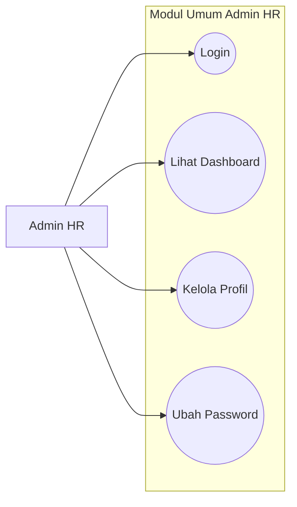
```mermaid
flowchart LR
    Admin[Admin HR]
    subgraph Modul["Modul Umum Admin HR"]
        A1((Login))
        A2((Lihat Dashboard))
        A3((Kelola Profil))
        A4((Ubah Password))
    end
    Admin --> A1
    Admin --> A2
    Admin --> A3
    Admin --> A4
```

### 1.2 Modul Data Pegawai

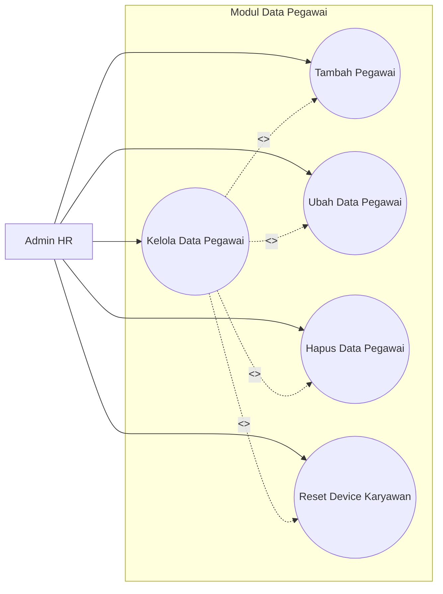
```mermaid
flowchart LR
    Admin[Admin HR]
    subgraph Modul["Modul Data Pegawai"]
        A9((Kelola Data Pegawai))
        A10((Tambah Pegawai))
        A11((Ubah Data Pegawai))
        A12((Hapus Data Pegawai))
        A13((Reset Device Karyawan))
    end
    Admin --> A9
    Admin --> A10
    Admin --> A11
    Admin --> A12
    Admin --> A13
    A9 -. "<<include>>" .-> A10
    A9 -. "<<include>>" .-> A11
    A9 -. "<<include>>" .-> A12
    A9 -. "<<extend>>" .-> A13
```

### 1.3 Modul Master Pegawai

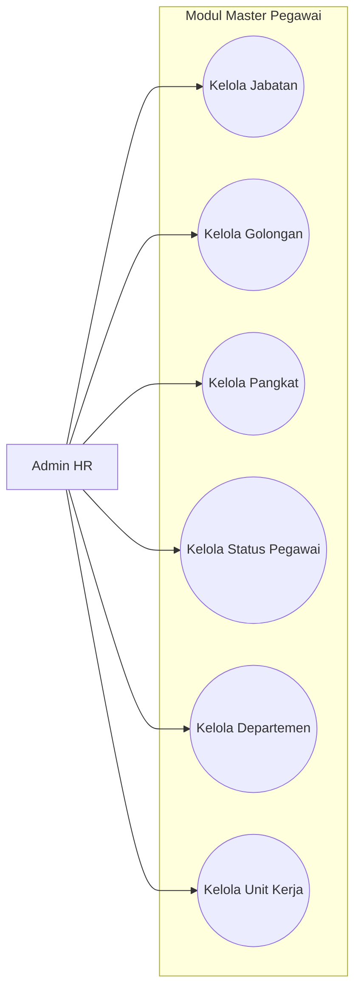
```mermaid
flowchart LR
    Admin[Admin HR]
    subgraph Modul["Modul Master Pegawai"]
        A14((Kelola Jabatan))
        A15((Kelola Golongan))
        A16((Kelola Pangkat))
        A17((Kelola Status Pegawai))
        A18((Kelola Departemen))
        A19((Kelola Unit Kerja))
    end
    Admin --> A14
    Admin --> A15
    Admin --> A16
    Admin --> A17
    Admin --> A18
    Admin --> A19
```

### 1.4 Modul Jadwal dan Cuti

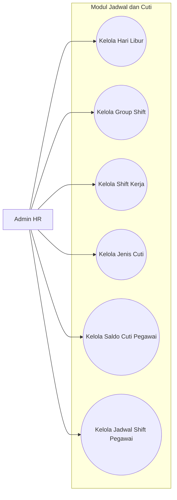
```mermaid
flowchart LR
    Admin[Admin HR]
    subgraph Modul["Modul Jadwal dan Cuti"]
        A20((Kelola Hari Libur))
        A21((Kelola Group Shift))
        A22((Kelola Shift Kerja))
        A23((Kelola Jenis Cuti))
        A24((Kelola Saldo Cuti Pegawai))
        A25((Kelola Jadwal Shift Pegawai))
    end
    Admin --> A20
    Admin --> A21
    Admin --> A22
    Admin --> A23
    Admin --> A24
    Admin --> A25
```

### 1.5 Modul Lokasi Absensi

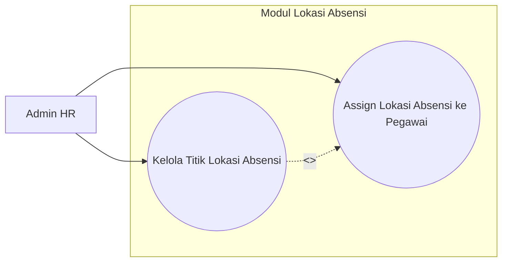
```mermaid
flowchart LR
    Admin[Admin HR]
    subgraph Modul["Modul Lokasi Absensi"]
        A26((Kelola Titik Lokasi Absensi))
        A27((Assign Lokasi Absensi ke Pegawai))
    end
    Admin --> A26
    Admin --> A27
    A26 -. "<<include>>" .-> A27
```

### 1.6 Modul Absensi Admin

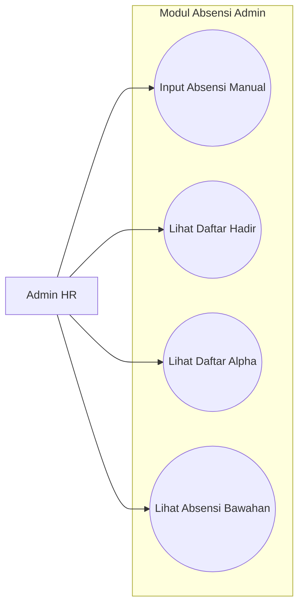
```mermaid
flowchart LR
    Admin[Admin HR]
    subgraph Modul["Modul Absensi Admin"]
        A28((Input Absensi Manual))
        A29((Lihat Daftar Hadir))
        A30((Lihat Daftar Alpha))
        A5((Lihat Absensi Bawahan))
    end
    Admin --> A28
    Admin --> A29
    Admin --> A30
    Admin --> A5
```

### 1.7 Modul Payroll

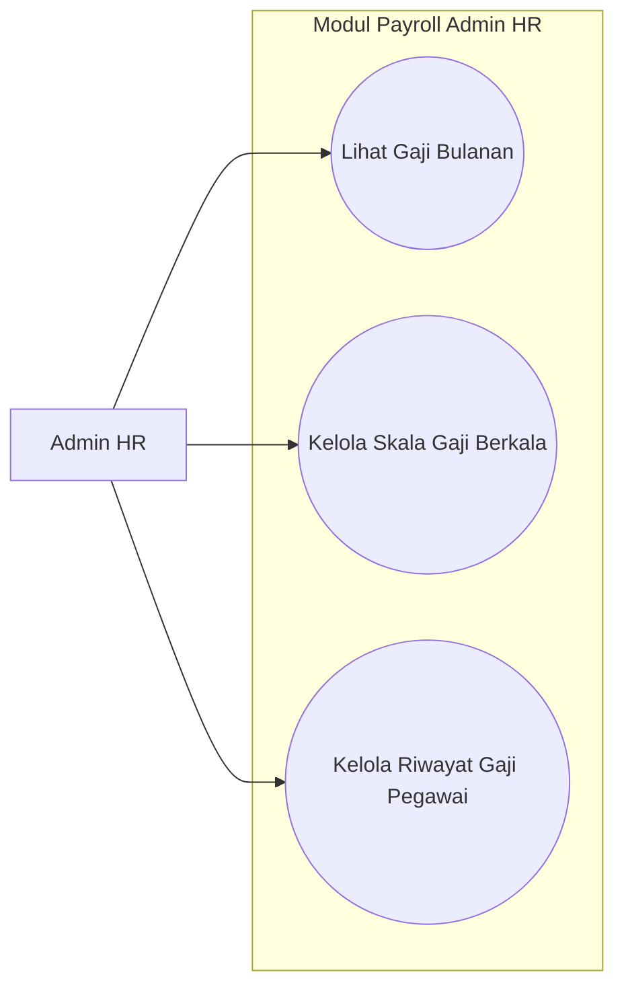
```mermaid
flowchart LR
    Admin[Admin HR]
    subgraph Modul["Modul Payroll Admin HR"]
        A31((Lihat Gaji Bulanan))
        A32((Kelola Skala Gaji Berkala))
        A33((Kelola Riwayat Gaji Pegawai))
    end
    Admin --> A31
    Admin --> A32
    Admin --> A33
```

### 1.8 Modul Approval

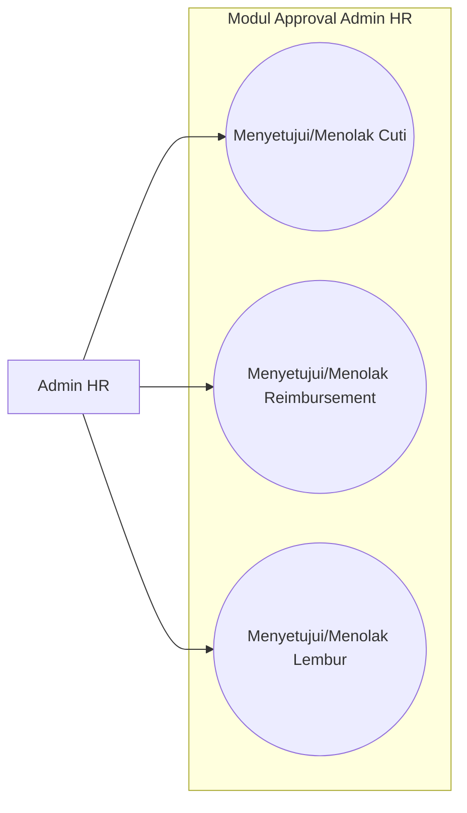
```mermaid
flowchart LR
    Admin[Admin HR]
    subgraph Modul["Modul Approval Admin HR"]
        A6((Menyetujui/Menolak Cuti))
        A7((Menyetujui/Menolak Reimbursement))
        A8((Menyetujui/Menolak Lembur))
    end
    Admin --> A6
    Admin --> A7
    Admin --> A8
```

## 2. Aktor Manager

### 2.1 Modul Umum Manager

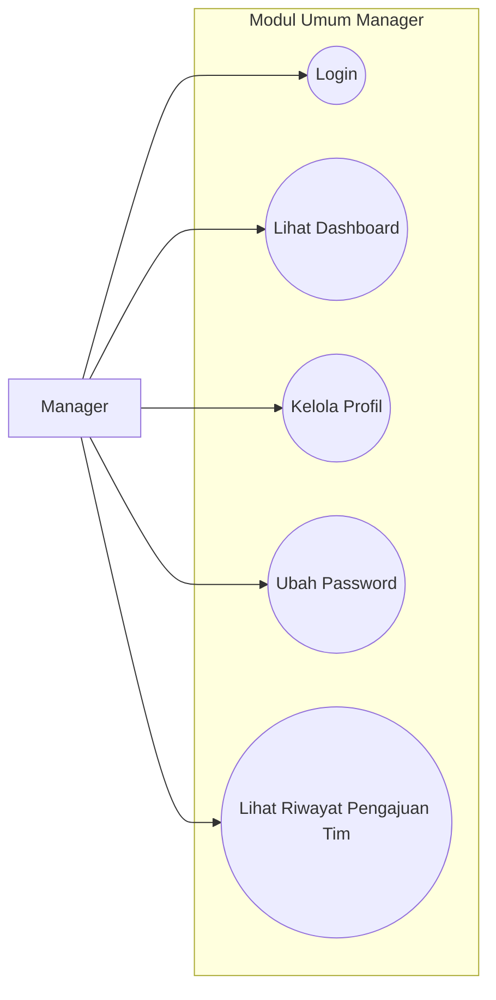
```mermaid
flowchart LR
    Manager[Manager]
    subgraph Modul["Modul Umum Manager"]
        M1((Login))
        M2((Lihat Dashboard))
        M3((Kelola Profil))
        M4((Ubah Password))
        M17((Lihat Riwayat Pengajuan Tim))
    end
    Manager --> M1
    Manager --> M2
    Manager --> M3
    Manager --> M4
    Manager --> M17
```

### 2.2 Modul Presensi

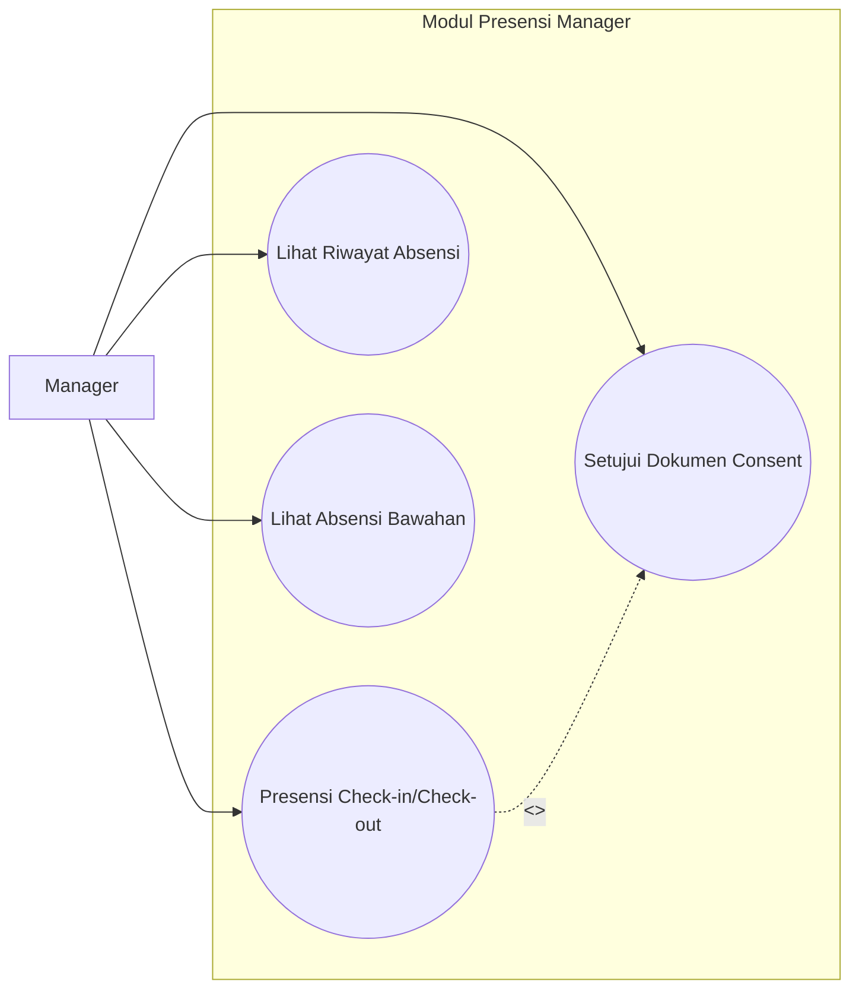
```mermaid
flowchart LR
    Manager[Manager]
    subgraph Modul["Modul Presensi Manager"]
        M5((Setujui Dokumen Consent))
        M6((Presensi Check-in/Check-out))
        M7((Lihat Riwayat Absensi))
        M8((Lihat Absensi Bawahan))
    end
    Manager --> M5
    Manager --> M6
    Manager --> M7
    Manager --> M8
    M6 -. "<<include>>" .-> M5
```

### 2.3 Modul Cuti

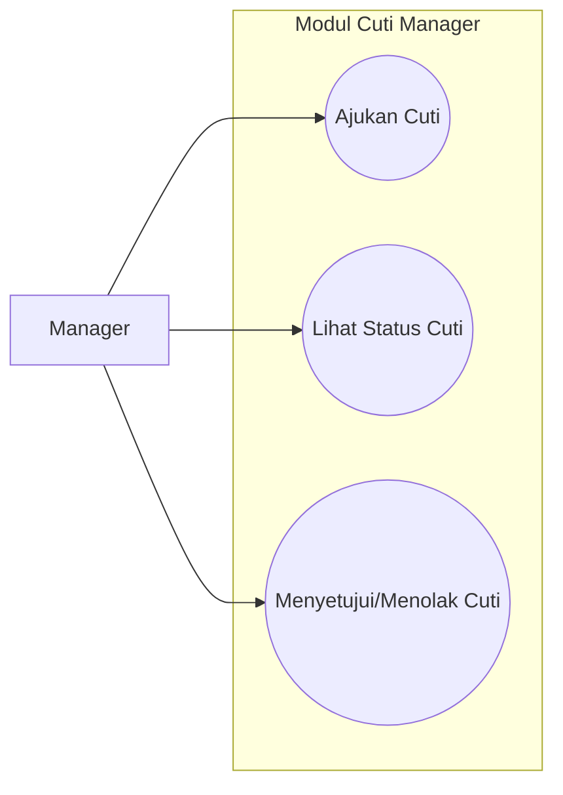
```mermaid
flowchart LR
    Manager[Manager]
    subgraph Modul["Modul Cuti Manager"]
        M9((Ajukan Cuti))
        M10((Lihat Status Cuti))
        M11((Menyetujui/Menolak Cuti))
    end
    Manager --> M9
    Manager --> M10
    Manager --> M11
```

### 2.4 Modul Reimbursement

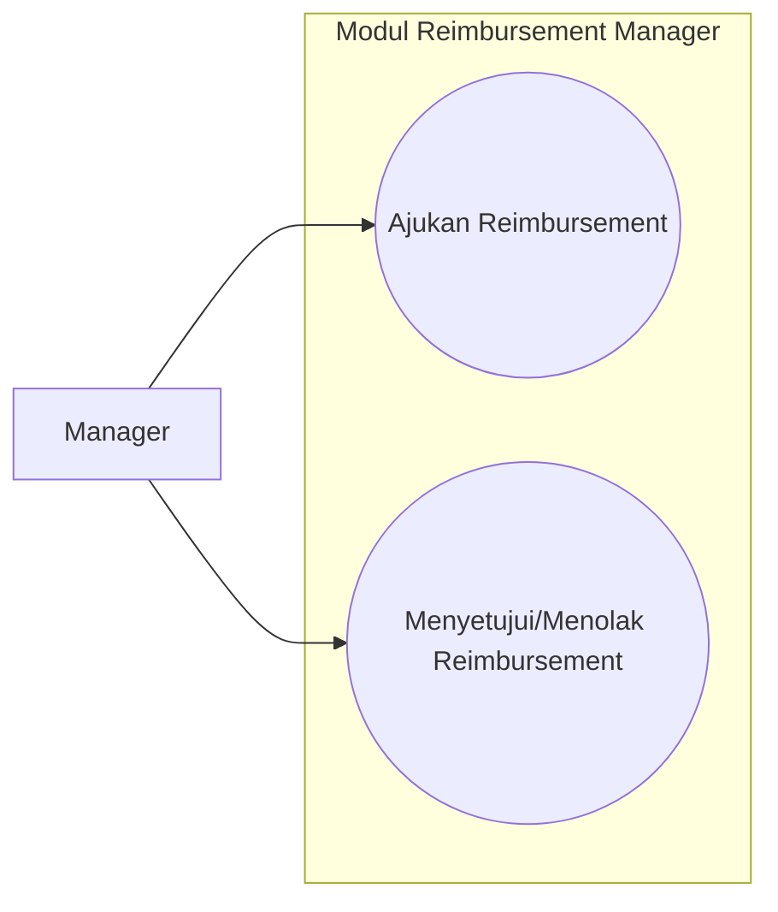
```mermaid
flowchart LR
    Manager[Manager]
    subgraph Modul["Modul Reimbursement Manager"]
        M12((Ajukan Reimbursement))
        M13((Menyetujui/Menolak Reimbursement))
    end
    Manager --> M12
    Manager --> M13
```

### 2.5 Modul Lembur

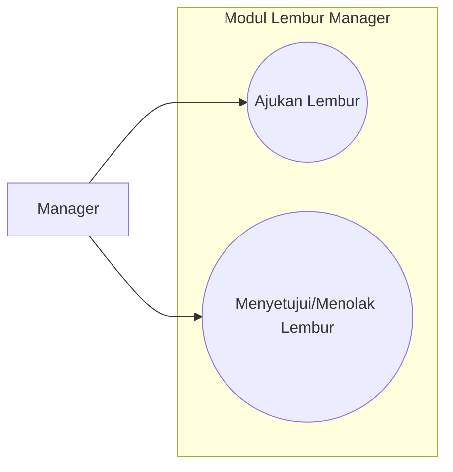
```mermaid
flowchart LR
    Manager[Manager]
    subgraph Modul["Modul Lembur Manager"]
        M14((Ajukan Lembur))
        M15((Menyetujui/Menolak Lembur))
    end
    Manager --> M14
    Manager --> M15
```

### 2.6 Modul Gaji

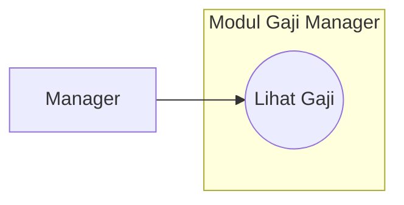
```mermaid
flowchart LR
    Manager[Manager]
    subgraph Modul["Modul Gaji Manager"]
        M16((Lihat Gaji))
    end
    Manager --> M16
```

## 3. Aktor Karyawan

### 3.1 Modul Umum Karyawan

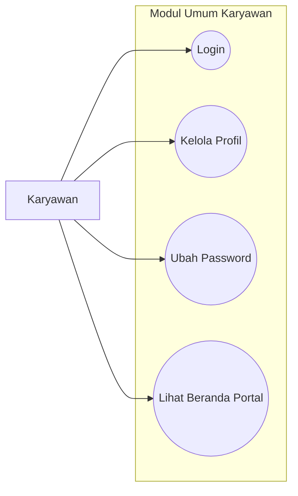
```mermaid
flowchart LR
    Karyawan[Karyawan]
    subgraph Modul["Modul Umum Karyawan"]
        K1((Login))
        K2((Kelola Profil))
        K3((Ubah Password))
        K12((Lihat Beranda Portal))
    end
    Karyawan --> K1
    Karyawan --> K2
    Karyawan --> K3
    Karyawan --> K12
```

### 3.2 Modul Presensi

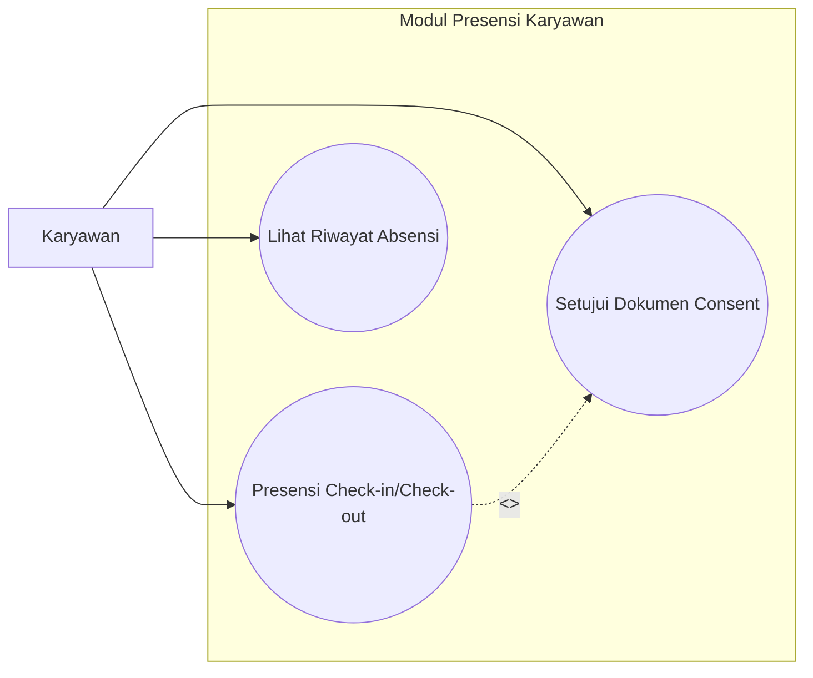
```mermaid
flowchart LR
    Karyawan[Karyawan]
    subgraph Modul["Modul Presensi Karyawan"]
        K4((Setujui Dokumen Consent))
        K5((Presensi Check-in/Check-out))
        K6((Lihat Riwayat Absensi))
    end
    Karyawan --> K4
    Karyawan --> K5
    Karyawan --> K6
    K5 -. "<<include>>" .-> K4
```

### 3.3 Modul Cuti

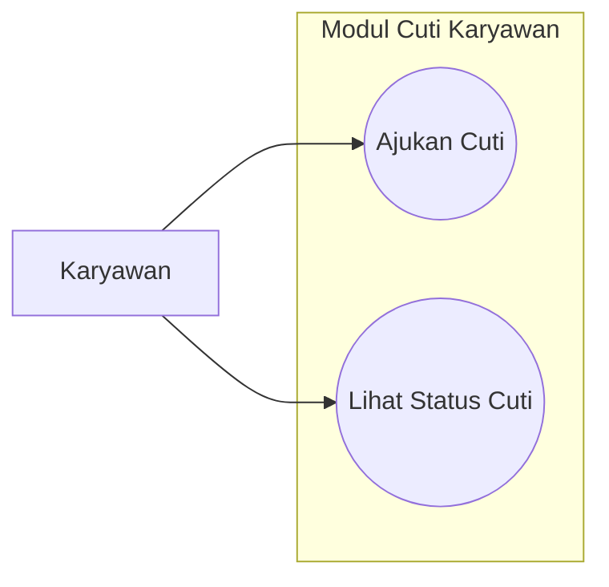
```mermaid
flowchart LR
    Karyawan[Karyawan]
    subgraph Modul["Modul Cuti Karyawan"]
        K7((Ajukan Cuti))
        K8((Lihat Status Cuti))
    end
    Karyawan --> K7
    Karyawan --> K8
```

### 3.4 Modul Reimbursement

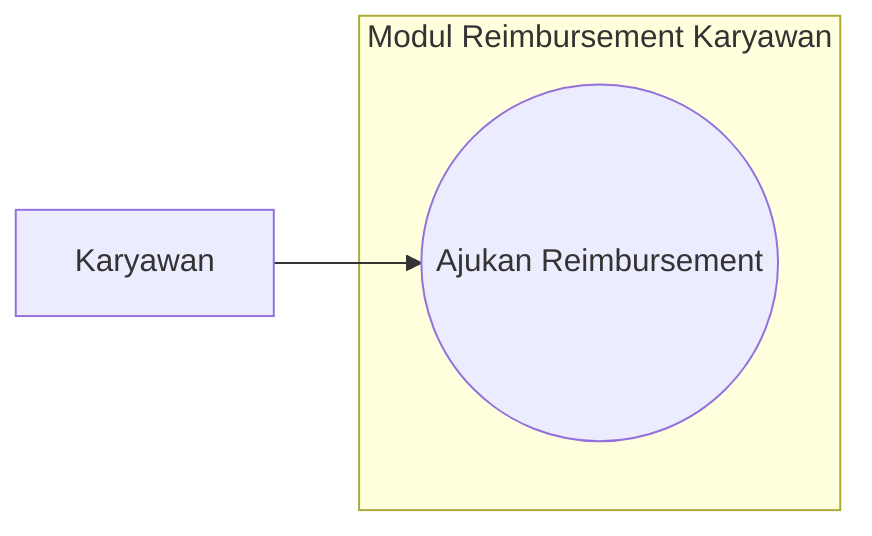
```mermaid
flowchart LR
    Karyawan[Karyawan]
    subgraph Modul["Modul Reimbursement Karyawan"]
        K9((Ajukan Reimbursement))
    end
    Karyawan --> K9
```

### 3.5 Modul Lembur

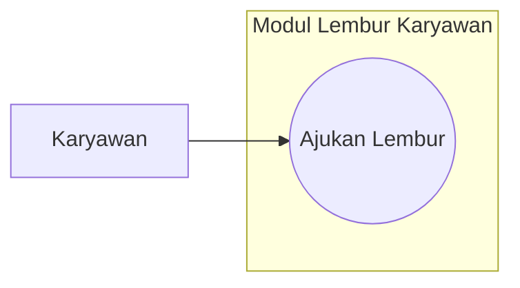
```mermaid
flowchart LR
    Karyawan[Karyawan]
    subgraph Modul["Modul Lembur Karyawan"]
        K10((Ajukan Lembur))
    end
    Karyawan --> K10
```

### 3.6 Modul Gaji

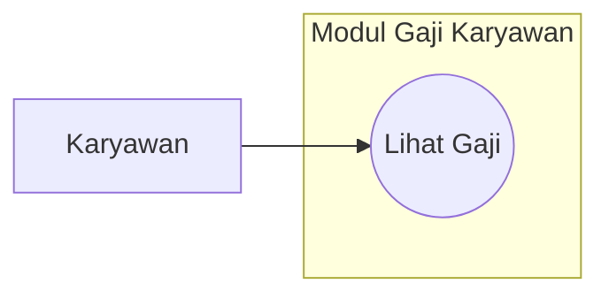
```mermaid
flowchart LR
    Karyawan[Karyawan]
    subgraph Modul["Modul Gaji Karyawan"]
        K11((Lihat Gaji))
    end
    Karyawan --> K11
```

## Ringkasan Fitur per Modul

### Tabel Scope Modul Admin HR

| Modul | Scope Fitur | Jenis Relasi |
|---|---|---|
| `Modul Umum` | Login, dashboard, kelola profil, ubah password | Association |
| `Modul Data Pegawai` | Kelola data pegawai, tambah, ubah, hapus, reset device | Association, `<<extend>>` untuk reset device |
| `Modul Master Pegawai` | Jabatan, golongan, pangkat, status pegawai, departemen, unit kerja | Association |
| `Modul Jadwal dan Cuti` | Hari libur, group shift, shift kerja, jenis cuti, saldo cuti, jadwal shift pegawai | Association |
| `Modul Lokasi Absensi` | Titik lokasi absensi dan assign lokasi ke pegawai | Association, dapat dijelaskan sebagai `<<include>>` bila assignment selalu bagian dari pengelolaan |
| `Modul Absensi Admin` | Input absensi manual, daftar hadir, daftar alpha, absensi bawahan | Association |
| `Modul Payroll` | Gaji bulanan, skala gaji berkala, riwayat gaji pegawai | Association |
| `Modul Approval` | Menyetujui/menolak cuti, reimbursement, lembur | Association |

### Tabel Scope Modul Manager

| Modul | Scope Fitur | Jenis Relasi |
|---|---|---|
| `Modul Umum` | Login, dashboard, kelola profil, ubah password, riwayat pengajuan tim | Association |
| `Modul Presensi` | Consent, presensi, riwayat absensi, absensi bawahan | Association, `<<include>>` presensi ke consent |
| `Modul Cuti` | Ajukan cuti, lihat status cuti, menyetujui/menolak cuti | Association |
| `Modul Reimbursement` | Ajukan reimbursement, menyetujui/menolak reimbursement | Association |
| `Modul Lembur` | Ajukan lembur, menyetujui/menolak lembur | Association |
| `Modul Gaji` | Lihat gaji pribadi | Association |

### Tabel Scope Modul Karyawan

| Modul | Scope Fitur | Jenis Relasi |
|---|---|---|
| `Modul Umum` | Login, kelola profil, ubah password, beranda portal | Association |
| `Modul Presensi` | Consent, presensi, riwayat absensi | Association, `<<include>>` presensi ke consent |
| `Modul Cuti` | Ajukan cuti, lihat status cuti | Association |
| `Modul Reimbursement` | Ajukan reimbursement | Association |
| `Modul Lembur` | Ajukan lembur | Association |
| `Modul Gaji` | Lihat gaji pribadi | Association |

## Rekomendasi Pemakaian Include dan Extend

Supaya lebih konsisten dengan ketentuan diagram use case formal, hubungan yang paling aman dipakai adalah:

- `Presensi Check-in/Check-out` `<<include>>` `Setujui Dokumen Consent`
  karena consent menjadi prasyarat proses presensi.
- `Reset Device Karyawan` `<<extend>>` `Kelola Data Pegawai`
  karena reset device adalah aksi tambahan pada konteks pengelolaan pegawai.

Hubungan berikut sebaiknya diperlakukan sebagai `rincian scope modul`, bukan relasi UML formal wajib:

- `Kelola Data Pegawai` dengan `Tambah Pegawai`, `Ubah Data Pegawai`, `Hapus Data Pegawai`
- `Kelola Titik Lokasi Absensi` dengan `Assign Lokasi Absensi ke Pegawai`
- `Modul Approval` dengan masing-masing approval cuti, reimbursement, dan lembur

Alasannya, relasi-relasi itu lebih cocok dibaca sebagai pemecahan fitur/menu daripada proses yang selalu memanggil sub-proses lain.

## Catatan

- Struktur ini dibuat mengikuti gaya diagram Anda yang dipisah `per aktor` dan `per modul`.
- Jika ingin, tiap blok `Mermaid` di atas bisa dijadikan satu kotak tersendiri di `Draw.io`.
- Untuk gambar skripsi, model seperti ini cocok bila Anda ingin menampilkan detail fitur tanpa membuat satu diagram tunggal terlalu padat.
